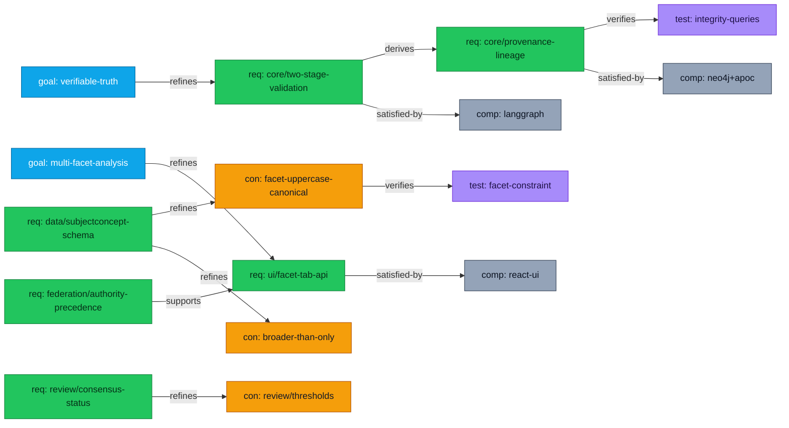
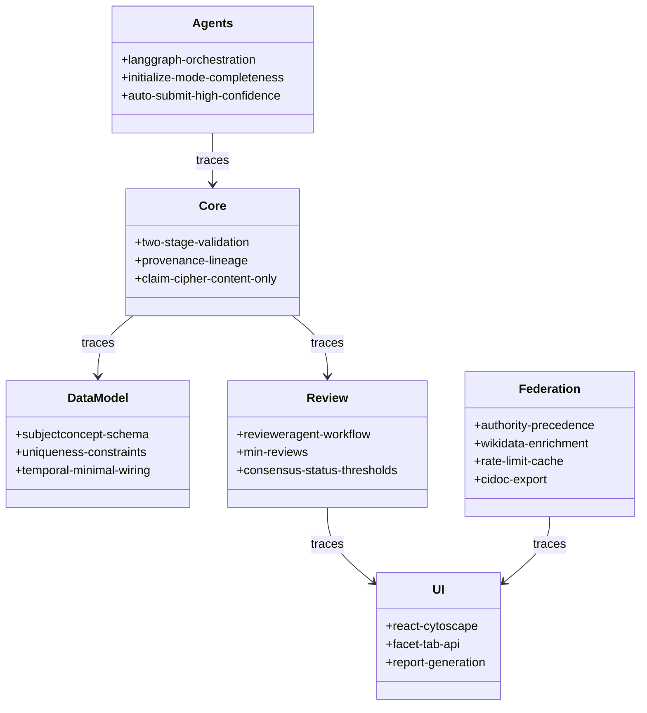

#requirments
According to a document from **2026-02-16** (“Chrystallum Architecture – CONSOLIDATED”), Chrystallum is a **two-stage, evidence-aware, multi-agent system** that builds a knowledge graph from unstructured text with deterministic validation, provenance chains, authority federation, and a React+Cytoscape UI. 

Thought for 1m 04s

---

## 1) Properties (YAML)

```yaml
run:
  run_id: run-2026-02-16-reqdef-001
  generated_at: 2026-02-16T00:00:00-05:00
  agent: agent:requirements-gpt
  domain: kg/chrystallum
sources:
  - id: src:chrystallum/arch/consolidated
    title: "2-12-26 Chrystallum Architecture - CONSOLIDATED.md"
    date_observed_in_doc: 2026-02-16
    notes:
      - "Two-stage architecture: LLM extraction → deterministic validation."
      - "Neo4j + APOC; LangGraph multi-agent orchestration; React + Cytoscape.js UI."
assumptions:
  - "No backlog.csv / risks.csv / scope_capacity.yaml were retrievable via file_search in this run; requirements below are derived from the consolidated architecture document only."
  - "‘v1 kernel’ scope = core traversal + subject + provenance + review workflow, with federated enrichment and UI patterns; cryptographic signing is treated as ‘v2/optional’ unless program direction says otherwise."
naming:
  id_scheme: "req:<domain>/<area>/<slug>"
  id_stability: "Stable kebab-case; no duplicates."
priorities:
  default_scale: [P0, P1, P2, P3]
  meaning:
    P0: "Foundational / blocking"
    P1: "Core product"
    P2: "Important"
    P3: "Nice-to-have / later"
quality_attribute_focus:
  - provenance
  - determinism
  - integrity
  - interoperability
  - operability
```

---

## 2) Graph Edges (table) — provenance from agent:requirements-gpt

| Source                                             | Relation     | Target                                            | Notes                                                                              | Provenance |
| -------------------------------------------------- | ------------ | ------------------------------------------------- | ---------------------------------------------------------------------------------- | ---------- |
| goal:kg/chrystallum/verifiable-truth               | REFINES      | req:kg/chrystallum/core/two-stage-validation      | Hallucination resistance via separation of extraction and deterministic validation |            |
| req:kg/chrystallum/core/two-stage-validation       | DERIVES      | req:kg/chrystallum/core/provenance-lineage        | Evidence-aware requirement implies complete provenance chain                       |            |
| req:kg/chrystallum/core/provenance-lineage         | REFINES      | req:kg/chrystallum/data/claim-extracted-from-work | Claims must not be orphaned; integrity checks look for this                        |            |
| req:kg/chrystallum/data/subjectconcept-schema      | REFINES      | con:kg/chrystallum/data/facet-uppercase-canonical | Facet keys must match canonical registry and be uppercase                          |            |
| req:kg/chrystallum/data/subjectconcept-schema      | REFINES      | con:kg/chrystallum/data/broader-than-only         | Store BROADER_THAN only; infer narrower via inverse traversal                      |            |
| req:kg/chrystallum/data/uniqueness-constraints     | REFINES      | con:kg/chrystallum/data/unique-ids                | Entity/Claim/QID uniqueness constraints                                            |            |
| req:kg/chrystallum/agents/langgraph-orchestration  | SATISFIED_BY | comp:kg/chrystallum/langgraph                     | Coordinator → SubjectAgent → EntityAgent → Neo4j write                             |            |
| req:kg/chrystallum/platform/neo4j-apoc             | SATISFIED_BY | comp:kg/chrystallum/neo4j                         | Neo4j 4.x+ (5.x recommended) + APOC                                                |            |
| req:kg/chrystallum/ui/react-cytoscape              | SATISFIED_BY | comp:kg/chrystallum/react-ui                      | React + Cytoscape.js front-end                                                     |            |
| req:kg/chrystallum/review/consensus-status         | REFINES      | con:kg/chrystallum/review/thresholds              | Validated/disputed/rejected thresholds                                             |            |
| req:kg/chrystallum/review/min-reviews              | REFINES      | con:kg/chrystallum/review/minimum-review-count    | Minimum reviews = 3                                                                |            |
| req:kg/chrystallum/federation/authority-precedence | REFINES      | con:kg/chrystallum/federation/tier-confidence     | Tier 1 LCSH/FAST (0.95) before LCC (0.85)                                          |            |
| req:kg/chrystallum/federation/wikidata-enrichment  | REFINES      | req:kg/chrystallum/federation/rate-limit-cache    | Rate limiting & caching for federation calls                                       |            |
| req:kg/chrystallum/ops/integrity-checks            | VERIFIED_BY  | test:kg/chrystallum/ops/integrity-queries         | Orphaned claims, missing props, duplicate QIDs, stale reviews                      |            |
| req:kg/chrystallum/ops/perf-monitoring             | VERIFIED_BY  | test:kg/chrystallum/ops/perf-queries              | Validation rate, consensus dist, avg review time                                   |            |
| req:kg/chrystallum/ui/facet-tab-api                | VERIFIED_BY  | test:kg/chrystallum/ui/facet-tab-query            | UI query returns grouped assessments JSON                                          |            |
| req:kg/chrystallum/agents/initialize-mode          | REFINES      | con:kg/chrystallum/agents/anchor-completeness     | Reject anchor entity completeness < 60%                                            |            |
| req:kg/chrystallum/security/claim-signing          | DERIVES      | req:kg/chrystallum/security/transparency-log      | Trust model via transparency logs + Merkle proofs                                  |            |
| req:kg/chrystallum/security/transparency-log       | VERIFIED_BY  | test:kg/chrystallum/security/merkle-consistency   | Consistency proof verification test                                                |            |

---

## 3) Requirements — SysML v2 (text/KerML)

```sysml
package kg::chrystallum {

  enum VerificationMethod { Test; Analysis; Demonstration; Inspection; }

  requirement def ChrystallumRequirement {
    attribute id : String;
    attribute title : String;
    attribute text : String;
    attribute reqType : String;        // Stakeholder | System | Derived | Nonfunctional | Compliance
    attribute priority : String;       // P0..P3
    attribute verification : VerificationMethod;
    attribute acceptanceCriteria : String;
    attribute rationale : String;
    attribute source : String;
  }

  // -------------------------
  // Stakeholder Goals (modeled as requirements for traceability)
  // -------------------------

  requirement goal_verifiable_truth : ChrystallumRequirement {
    id = "req:kg/chrystallum/goal/verifiable-truth";
    title = "Verifiable truth from unstructured evidence";
    text = "The system shall construct structured knowledge from unstructured evidence such that every asserted claim can be traced to specific source text and validated deterministically.";
    reqType = "Stakeholder";
    priority = "P0";
    verification = Inspection;
    acceptanceCriteria = "For a sample corpus, each published claim links to a Work and a passage reference; deterministic validation logs show pass/fail rules applied.";
    rationale = "High-stakes use requires hallucination resistance and provenance.";
    source = "src:chrystallum/arch/consolidated";
  }

  requirement goal_multifacet_analysis : ChrystallumRequirement {
    id = "req:kg/chrystallum/goal/multi-facet-analysis";
    title = "Facet-based analysis and navigation";
    text = "The system shall support multi-dimensional analysis using canonical facets and facet categories to enable independent evaluation views (e.g., Political, Military, Economic).";
    reqType = "Stakeholder";
    priority = "P1";
    verification = Demonstration;
    acceptanceCriteria = "UI demonstrates facet-tab navigation returning grouped assessments for a claim.";
    rationale = "Supports analytic workflows and specialist review.";
    source = "src:chrystallum/arch/consolidated";
  }

  // -------------------------
  // Core System Requirements
  // -------------------------

  requirement req_two_stage_validation : ChrystallumRequirement {
    id = "req:kg/chrystallum/core/two-stage-validation";
    title = "Two-stage pipeline: extraction then deterministic validation";
    text = "The system shall separate probabilistic LLM extraction from deterministic, rule-based validation prior to persisting knowledge to the graph.";
    reqType = "System";
    priority = "P0";
    verification = Test;
    acceptanceCriteria = "Injected invalid classifications are rejected by validation before commit; only validated structures are written.";
    rationale = "Prevents hallucination from entering the knowledge base.";
    source = "src:chrystallum/arch/consolidated";
  }

  requirement req_provenance_lineage : ChrystallumRequirement {
    id = "req:kg/chrystallum/core/provenance-lineage";
    title = "Complete provenance chain for knowledge";
    text = "The system shall maintain complete provenance chains for all claims, including linkage to source Works and passage text sufficient to trace assertions back to a specific line of text.";
    reqType = "System";
    priority = "P0";
    verification = Inspection;
    acceptanceCriteria = "No Claim remains without an EXTRACTED_FROM link to a Work; spot checks show passage text stored for reviewed claims.";
    rationale = "Evidence-aware knowledge requires auditable provenance.";
    source = "src:chrystallum/arch/consolidated";
  }

  requirement req_claim_not_orphaned : ChrystallumRequirement {
    id = "req:kg/chrystallum/data/claim-extracted-from-work";
    title = "Claims link to Works";
    text = "The system shall enforce that every Claim is linked to at least one Work via EXTRACTED_FROM.";
    reqType = "Derived";
    priority = "P0";
    verification = Test;
    acceptanceCriteria = "Integrity query for orphaned claims returns zero rows after ingestion and review workflows.";
    rationale = "Eliminates unverifiable claims.";
    source = "src:chrystallum/arch/consolidated";
  }

  requirement req_claim_cipher_content_only : ChrystallumRequirement {
    id = "req:kg/chrystallum/data/claim-cipher-content-only";
    title = "Content-only claim cipher for deduplication";
    text = "The system shall compute a content-only cipher for each claim to enable deduplication across time and agents, independent of signatures.";
    reqType = "System";
    priority = "P1";
    verification = Test;
    acceptanceCriteria = "Two identical claims from different agents produce the same cipher; signature attachment does not alter cipher.";
    rationale = "Stable identity for claims and later trust layers.";
    source = "src:chrystallum/arch/consolidated";
  }

  requirement req_uniqueness_constraints : ChrystallumRequirement {
    id = "req:kg/chrystallum/data/uniqueness-constraints";
    title = "Uniqueness constraints for core identifiers";
    text = "The system shall enforce uniqueness constraints for entity_id, claim_id, and external authority identifiers (e.g., Wikidata QID, VIAF) as defined by the schema.";
    reqType = "System";
    priority = "P0";
    verification = Test;
    acceptanceCriteria = "Attempted insertion of duplicate IDs fails with constraint violation; duplicate-QID integrity query yields zero rows.";
    rationale = "Prevents identity corruption.";
    source = "src:chrystallum/arch/consolidated";
  }

  requirement req_subjectconcept_schema : ChrystallumRequirement {
    id = "req:kg/chrystallum/data/subjectconcept-schema";
    title = "SubjectConcept schema and SKOS broader-only modeling";
    text = "The system shall model SubjectConcept nodes with required properties (subject_id, label, facet) and store only BROADER_THAN edges, inferring narrower traversal at query time.";
    reqType = "System";
    priority = "P0";
    verification = Test;
    acceptanceCriteria = "SubjectConcept creation requires subject_id, label, facet; no NARROWER_THAN edges are stored; inverse traversal returns narrower concepts.";
    rationale = "Reduces density while preserving semantics.";
    source = "src:chrystallum/arch/consolidated";
  }

  requirement req_facet_enforcement : ChrystallumRequirement {
    id = "req:kg/chrystallum/data/facet-normalization-enforcement";
    title = "Canonical facet enforcement (uppercase keys)";
    text = "The system shall enforce canonical facet keys (uppercase) at both application validation and database constraint layers to prevent invalid facet values from entering the graph.";
    reqType = "System";
    priority = "P0";
    verification = Test;
    acceptanceCriteria = "Creating a SubjectConcept with a non-canonical facet fails in validation and on commit; error message lists allowed facets.";
    rationale = "Deterministic routing and filtering require canonical facets.";
    source = "src:chrystallum/arch/consolidated";
  }

  requirement req_temporal_minimal_wiring : ChrystallumRequirement {
    id = "req:kg/chrystallum/data/temporal-minimal-wiring";
    title = "Minimal temporal wiring for scale";
    text = "The system shall represent event temporal bounds using minimal wiring (e.g., STARTS_IN_YEAR and ENDS_IN_YEAR) and avoid materializing intermediate year edges except for explicitly justified UI needs.";
    reqType = "System";
    priority = "P1";
    verification = Inspection;
    acceptanceCriteria = "Events spanning multiple years do not create per-year edges by default; timeline queries expand intermediate years at query/UI time.";
    rationale = "Avoids over-edging and scale issues.";
    source = "src:chrystallum/arch/consolidated";
  }

  // -------------------------
  // Agents & Orchestration
  // -------------------------

  requirement req_langgraph_orchestration : ChrystallumRequirement {
    id = "req:kg/chrystallum/agents/langgraph-orchestration";
    title = "Multi-agent orchestration workflow";
    text = "The system shall orchestrate agents in a defined workflow graph (CoordinatorAgent → SubjectAgent → EntityAgent → Neo4j writer) with shared state and conditional routing.";
    reqType = "System";
    priority = "P1";
    verification = Demonstration;
    acceptanceCriteria = "A sample query executes through the agent chain and results in validated writes to Neo4j, with logged routing decisions.";
    rationale = "Specialization + controlled collaboration.";
    source = "src:chrystallum/arch/consolidated";
  }

  requirement req_agent_schema_introspection : ChrystallumRequirement {
    id = "req:kg/chrystallum/agents/schema-introspection-first";
    title = "Schema introspection before data mutation";
    text = "Agents shall introspect node schemas and allowed relationships before generating or writing claims.";
    reqType = "Derived";
    priority = "P1";
    verification = Inspection;
    acceptanceCriteria = "Agent run logs show schema introspection calls prior to writes; invalid relationship types are not attempted.";
    rationale = "Prevents schema drift and invalid writes.";
    source = "src:chrystallum/arch/consolidated";
  }

  requirement req_initialize_mode_completeness : ChrystallumRequirement {
    id = "req:kg/chrystallum/agents/initialize-mode";
    title = "Initialize mode completeness gate";
    text = "The system shall reject initialization from a Wikidata anchor entity when computed completeness is below 60%.";
    reqType = "System";
    priority = "P1";
    verification = Test;
    acceptanceCriteria = "Anchors with completeness < 0.60 return status REJECTED; anchors ≥ 0.60 proceed to enrichment and bootstrap.";
    rationale = "Avoids bootstrapping from low-quality anchors.";
    source = "src:chrystallum/arch/consolidated";
  }

  requirement req_auto_submit_high_conf : ChrystallumRequirement {
    id = "req:kg/chrystallum/agents/auto-submit-high-confidence";
    title = "Optional auto-submit for high-confidence claims";
    text = "When configured, the system shall automatically submit claims with confidence ≥ 0.90 during training/initialize runs.";
    reqType = "System";
    priority = "P2";
    verification = Test;
    acceptanceCriteria = "With auto-submit enabled, claims at or above 0.90 are submitted without manual intervention; below threshold are not.";
    rationale = "Speeds safe bootstrapping.";
    source = "src:chrystallum/arch/consolidated";
  }

  // -------------------------
  // Review & Consensus
  // -------------------------

  requirement req_review_workflow : ChrystallumRequirement {
    id = "req:kg/chrystallum/review/revieweragent-workflow";
    title = "Claim review workflow with Review nodes";
    text = "The system shall support a claim review workflow where ReviewerAgents evaluate claims and record Review nodes including verdict, confidence, reasoning summary, and detected fallacies.";
    reqType = "System";
    priority = "P0";
    verification = Demonstration;
    acceptanceCriteria = "A proposed claim can be reviewed; Review nodes are created and linked; review metadata is retrievable.";
    rationale = "Human/agent adjudication and explainability.";
    source = "src:chrystallum/arch/consolidated";
  }

  requirement req_min_reviews : ChrystallumRequirement {
    id = "req:kg/chrystallum/review/min-reviews";
    title = "Minimum reviews before status promotion";
    text = "The system shall require at least 3 reviews before a claim status can be promoted from proposed.";
    reqType = "System";
    priority = "P0";
    verification = Test;
    acceptanceCriteria = "Claims with <3 reviews remain proposed regardless of interim consensus score.";
    rationale = "Avoids premature validation.";
    source = "src:chrystallum/arch/consolidated";
  }

  requirement req_consensus_status_thresholds : ChrystallumRequirement {
    id = "req:kg/chrystallum/review/consensus-status";
    title = "Consensus scoring and status thresholds";
    text = "The system shall compute a weighted Bayesian consensus score and set claim status as: validated when consensus ≥ 0.8 and support ratio ≥ 0.7; disputed when consensus ≥ 0.5 with mixed reviews; rejected when consensus < 0.5.";
    reqType = "System";
    priority = "P0";
    verification = Test;
    acceptanceCriteria = "Synthetic review sets drive expected status transitions across all threshold boundaries.";
    rationale = "Deterministic adjudication rules.";
    source = "src:chrystallum/arch/consolidated";
  }

  requirement req_stale_proposed_claims : ChrystallumRequirement {
    id = "req:kg/chrystallum/review/stale-claims-detection";
    title = "Stale proposed claim detection";
    text = "The system shall detect proposed claims lacking reviews after 7 days and surface them for review.";
    reqType = "Derived";
    priority = "P1";
    verification = Test;
    acceptanceCriteria = "Integrity query returns proposed claims older than 7 days with no reviews; workflow can enqueue them.";
    rationale = "Prevents backlog rot and improves throughput.";
    source = "src:chrystallum/arch/consolidated";
  }

  // -------------------------
  // Federation & Interoperability
  // -------------------------

  requirement req_authority_precedence : ChrystallumRequirement {
    id = "req:kg/chrystallum/federation/authority-precedence";
    title = "Authority precedence for subject federation";
    text = "The system shall apply tiered authority precedence for subject classification: Tier 1 LCSH/FAST first (confidence 0.95), Tier 2 LCC/CIP as fallback (confidence 0.85), and Tier 3 Wikidata plus domain authorities for specialist grounding.";
    reqType = "System";
    priority = "P0";
    verification = Test;
    acceptanceCriteria = "Given a subject string with LCSH coverage, the system assigns Tier 1; absent LCSH, assigns Tier 2; Tier metadata and confidence are stored.";
    rationale = "Library-grade subject control with controlled fallbacks.";
    source = "src:chrystallum/arch/consolidated";
  }

  requirement req_wikidata_enrichment : ChrystallumRequirement {
    id = "req:kg/chrystallum/federation/wikidata-enrichment";
    title = "Federated enrichment via Wikidata identifiers";
    text = "The system shall enrich nodes using Wikidata QIDs to retrieve federation identifiers (e.g., Pleiades, VIAF, GeoNames), store enrichment metadata, and write results to Neo4j.";
    reqType = "System";
    priority = "P1";
    verification = Demonstration;
    acceptanceCriteria = "For an entity with a QID, enrichment populates authority IDs and records enrichment timestamp and sources.";
    rationale = "Improves identity resolution and cross-institution linking.";
    source = "src:chrystallum/arch/consolidated";
  }

  requirement req_federation_rate_limit_cache : ChrystallumRequirement {
    id = "req:kg/chrystallum/federation/rate-limit-cache";
    title = "Rate limiting and retry for federation calls";
    text = "The system shall implement caching, retry, and rate-limit backoff for federation API calls and handle HTTP 429 rate limiting gracefully.";
    reqType = "Nonfunctional";
    priority = "P1";
    verification = Test;
    acceptanceCriteria = "Simulated 429 responses trigger exponential backoff; successful retries populate enrichment; failures are logged without corrupting writes.";
    rationale = "Operational stability and politeness to upstream services.";
    source = "src:chrystallum/arch/consolidated";
  }

  requirement req_cidoc_export : ChrystallumRequirement {
    id = "req:kg/chrystallum/interoperability/cidoc-export";
    title = "CIDOC-CRM compatible export";
    text = "The system shall support exporting knowledge in CIDOC-CRM compatible RDF/OWL mappings to enable museum/archival interoperability (ISO 21127:2023 aligned).";
    reqType = "Compliance";
    priority = "P2";
    verification = Analysis;
    acceptanceCriteria = "Exported data validates against the selected CIDOC-CRM mapping profile for a representative subgraph.";
    rationale = "Interoperability with cultural heritage systems.";
    source = "src:chrystallum/arch/consolidated";
  }

  // -------------------------
  // UI & Reporting
  // -------------------------

  requirement req_ui_react_cytoscape : ChrystallumRequirement {
    id = "req:kg/chrystallum/ui/react-cytoscape";
    title = "Graph UI implementation";
    text = "The system shall provide a front-end implemented with React and Cytoscape.js for graph visualization.";
    reqType = "System";
    priority = "P2";
    verification = Demonstration;
    acceptanceCriteria = "UI renders a subgraph and supports basic interaction (pan/zoom/select) for a loaded dataset.";
    rationale = "Human navigation and exploration of the knowledge graph.";
    source = "src:chrystallum/arch/consolidated";
  }

  requirement req_ui_facet_tabs : ChrystallumRequirement {
    id = "req:kg/chrystallum/ui/facet-tab-api";
    title = "Facet tab interface query contract";
    text = "The system shall provide a query/API that returns facet assessments grouped by facet category to support a facet tab interface.";
    reqType = "System";
    priority = "P1";
    verification = Test;
    acceptanceCriteria = "Query returns deterministic JSON structure with category keys and ordered assessments for a given claim.";
    rationale = "Supports multi-facet analytic views.";
    source = "src:chrystallum/arch/consolidated";
  }

  requirement req_report_generation : ChrystallumRequirement {
    id = "req:kg/chrystallum/ui/report-generation";
    title = "Run completion and report generation";
    text = "The system shall mark analysis runs as completed and generate UI-ready reports that include facet assessments and overall confidence.";
    reqType = "System";
    priority = "P2";
    verification = Demonstration;
    acceptanceCriteria = "Completing a run produces a report object with ui_ready=true and includes facet assessments payload.";
    rationale = "Enables review, presentation, and downstream use.";
    source = "src:chrystallum/arch/consolidated";
  }

  // -------------------------
  // Operations & Governance
  // -------------------------

  requirement req_governance_indexing_batchwrites : ChrystallumRequirement {
    id = "req:kg/chrystallum/ops/governance-indexing-batchwrites";
    title = "Governance: indexing + batch writes + directionality rules";
    text = "The system shall implement governance practices including schema versioning, indexing for frequently queried properties, batch writes for bulk operations, and intentional relationship directionality (e.g., BROADER_THAN only).";
    reqType = "Nonfunctional";
    priority = "P1";
    verification = Inspection;
    acceptanceCriteria = "Operational documentation and DB schema show required indexes/constraints; bulk loaders use batch writes; directionality conventions are followed.";
    rationale = "Long-term maintainability and performance.";
    source = "src:chrystallum/arch/consolidated";
  }

  requirement req_integrity_checks : ChrystallumRequirement {
    id = "req:kg/chrystallum/ops/integrity-checks";
    title = "Integrity check queries";
    text = "The system shall provide integrity check queries for orphaned claims, entities missing required properties, duplicate QIDs, and claims lacking timely reviews.";
    reqType = "System";
    priority = "P1";
    verification = Test;
    acceptanceCriteria = "All integrity queries execute successfully and return expected results on seeded negative test data.";
    rationale = "Detects data quality regressions early.";
    source = "src:chrystallum/arch/consolidated";
  }

  requirement req_perf_monitoring_queries : ChrystallumRequirement {
    id = "req:kg/chrystallum/ops/perf-monitoring";
    title = "Performance monitoring queries";
    text = "The system shall provide monitoring queries for agent productivity, validation rate, consensus distribution, and average review time.";
    reqType = "Nonfunctional";
    priority = "P2";
    verification = Test;
    acceptanceCriteria = "Monitoring queries execute and produce metrics on a representative dataset.";
    rationale = "Operational visibility and calibration.";
    source = "src:chrystallum/arch/consolidated";
  }

  requirement req_agent_weight_alert : ChrystallumRequirement {
    id = "req:kg/chrystallum/ops/agent-weight-alert";
    title = "Agent performance calibration alerting";
    text = "The system shall update agent calibration based on recent history and alert when an agent’s weight drops below 0.9.";
    reqType = "Nonfunctional";
    priority = "P3";
    verification = Test;
    acceptanceCriteria = "When computed weight < 0.9, the system logs a warning and triggers an alert action; otherwise it does not.";
    rationale = "Early detection of degraded agent behavior.";
    source = "src:chrystallum/arch/consolidated";
  }

  // -------------------------
  // Security / Trust (v2 / optional)
  // -------------------------

  requirement req_claim_signing : ChrystallumRequirement {
    id = "req:kg/chrystallum/security/claim-signing";
    title = "Institutional claim signing";
    text = "The system shall support optional institutional signing of claims using Ed25519, with signatures maintained separately from the content cipher.";
    reqType = "System";
    priority = "P3";
    verification = Test;
    acceptanceCriteria = "Signed claim verifies with institution public key; modifying claim content invalidates signature; cipher remains content-derived.";
    rationale = "Enables verifiable provenance without a central authority.";
    source = "src:chrystallum/arch/consolidated";
  }

  requirement req_transparency_logs : ChrystallumRequirement {
    id = "req:kg/chrystallum/security/transparency-log";
    title = "Transparency logs and Merkle consistency proofs";
    text = "The system shall support append-only transparency logs for signed claims and verify Merkle consistency proofs to detect log tampering.";
    reqType = "System";
    priority = "P3";
    verification = Test;
    acceptanceCriteria = "Consistency proof verification succeeds across batches; tampering causes verification failure.";
    rationale = "Auditable trust model at consortium scale.";
    source = "src:chrystallum/arch/consolidated";
  }

  // -------------------------
  // Platform / Technology
  // -------------------------

  requirement req_platform_stack : ChrystallumRequirement {
    id = "req:kg/chrystallum/platform/stack";
    title = "Platform stack requirements";
    text = "The implementation shall use Python 3.11+ with Neo4j 4.x+ (5.x recommended), APOC extensions, LangGraph for orchestration, and an LLM provider for extraction.";
    reqType = "System";
    priority = "P1";
    verification = Inspection;
    acceptanceCriteria = "Deployment manifest lists required versions and dependencies; system starts and runs a smoke test workflow.";
    rationale = "Anchors implementation to supported stack.";
    source = "src:chrystallum/arch/consolidated";
  }

  // -------------------------
  // Constraints (modeled as requirements for enforcement)
  // -------------------------

  requirement con_facet_uppercase : ChrystallumRequirement {
    id = "con:kg/chrystallum/data/facet-uppercase-canonical";
    title = "Facet canonicalization constraint";
    text = "Facet values shall be uppercase and must match the canonical facet registry list enforced by application validation and Neo4j constraints.";
    reqType = "Constraint";
    priority = "P0";
    verification = Test;
    acceptanceCriteria = "Invalid facet values fail; valid ones succeed.";
    rationale = "Prevents case-collision and invalid routing.";
    source = "src:chrystallum/arch/consolidated";
  }

  requirement con_broader_only : ChrystallumRequirement {
    id = "con:kg/chrystallum/data/broader-than-only";
    title = "SKOS broader-only constraint";
    text = "Only BROADER_THAN edges shall be stored for subject hierarchies; narrower traversal shall be implied by inverse traversal.";
    reqType = "Constraint";
    priority = "P1";
    verification = Inspection;
    acceptanceCriteria = "Schema and loaders do not create NARROWER_THAN edges.";
    rationale = "Controls graph density.";
    source = "src:chrystallum/arch/consolidated";
  }

  requirement con_anchor_completeness : ChrystallumRequirement {
    id = "con:kg/chrystallum/agents/anchor-completeness";
    title = "Anchor completeness threshold";
    text = "Initialize mode shall reject anchor entities with completeness < 0.60.";
    reqType = "Constraint";
    priority = "P1";
    verification = Test;
    acceptanceCriteria = "Completeness computation gates initialization at 0.60.";
    rationale = "Quality gate for bootstrapping.";
    source = "src:chrystallum/arch/consolidated";
  }

  requirement con_review_thresholds : ChrystallumRequirement {
    id = "con:kg/chrystallum/review/thresholds";
    title = "Review threshold parameters";
    text = "Minimum reviews = 3; validated threshold consensus ≥ 0.8 AND support ratio ≥ 0.7; disputed threshold consensus ≥ 0.5 with mixed reviews; rejected threshold consensus < 0.5.";
    reqType = "Constraint";
    priority = "P0";
    verification = Test;
    acceptanceCriteria = "Unit tests cover each boundary case.";
    rationale = "Deterministic adjudication.";
    source = "src:chrystallum/arch/consolidated";
  }

  // -------------------------
  // Verification Cases
  // -------------------------

  requirement test_facet_constraint : ChrystallumRequirement {
    id = "test:kg/chrystallum/data/facet-constraint";
    title = "Test: facet constraint enforcement";
    text = "Verify invalid facet values are rejected at validation and commit time.";
    reqType = "Test";
    priority = "P0";
    verification = Test;
    acceptanceCriteria = "Invalid facet insert fails; valid insert succeeds.";
    rationale = "Guards canonical facet policy.";
    source = "src:chrystallum/arch/consolidated";
  }

  requirement test_integrity_queries : ChrystallumRequirement {
    id = "test:kg/chrystallum/ops/integrity-queries";
    title = "Test: integrity queries";
    text = "Verify integrity queries detect seeded negative conditions (orphaned claims, missing properties, duplicate QIDs, stale reviews).";
    reqType = "Test";
    priority = "P1";
    verification = Test;
    acceptanceCriteria = "Each query returns expected rows on negative seed and zero rows after remediation.";
    rationale = "Prevents silent corruption.";
    source = "src:chrystallum/arch/consolidated";
  }

  requirement test_merkle_consistency : ChrystallumRequirement {
    id = "test:kg/chrystallum/security/merkle-consistency";
    title = "Test: transparency log consistency proofs";
    text = "Verify Merkle consistency proofs across transparency log batches.";
    reqType = "Test";
    priority = "P3";
    verification = Test;
    acceptanceCriteria = "Consistency proof verifies for valid batches and fails on tampering.";
    rationale = "Auditable trust enforcement.";
    source = "src:chrystallum/arch/consolidated";
  }

}
```

---

## 4) Mermaid diagrams





---

## 5) Synchronized Exports (Cypher, Cytoscape CSV, XMind, Juggl, VP CSV)

### 5.1 Cypher (nodes + edges)

```cypher
// Nodes
MERGE (g1:Stakeholder {id:"goal:kg/chrystallum/verifiable-truth", title:"Verifiable truth from unstructured evidence"});
MERGE (g2:Stakeholder {id:"goal:kg/chrystallum/multi-facet-analysis", title:"Facet-based analysis and navigation"});

MERGE (r1:Requirement {id:"req:kg/chrystallum/core/two-stage-validation", title:"Two-stage pipeline"});
MERGE (r2:Requirement {id:"req:kg/chrystallum/core/provenance-lineage", title:"Complete provenance chain"});
MERGE (r3:Requirement {id:"req:kg/chrystallum/data/subjectconcept-schema", title:"SubjectConcept schema"});
MERGE (r4:Requirement {id:"req:kg/chrystallum/review/consensus-status", title:"Consensus scoring thresholds"});
MERGE (r5:Requirement {id:"req:kg/chrystallum/federation/authority-precedence", title:"Authority precedence"});
MERGE (r6:Requirement {id:"req:kg/chrystallum/ui/facet-tab-api", title:"Facet tab API contract"});

MERGE (c1:Constraint {id:"con:kg/chrystallum/data/facet-uppercase-canonical", title:"Facet canonicalization"});
MERGE (t1:Test {id:"test:kg/chrystallum/data/facet-constraint", title:"Facet constraint enforcement test"});

MERGE (a1:Artifact {id:"comp:kg/chrystallum/langgraph", title:"LangGraph Orchestration"});
MERGE (a2:Artifact {id:"comp:kg/chrystallum/neo4j", title:"Neo4j + APOC"});
MERGE (a3:Artifact {id:"comp:kg/chrystallum/react-ui", title:"React + Cytoscape UI"});

// Relationships
MERGE (g1)-[:REFINES]->(r1);
MERGE (r1)-[:DERIVES]->(r2);
MERGE (r3)-[:REFINES]->(c1);
MERGE (c1)-[:VERIFIED_BY]->(t1);
MERGE (r1)-[:SATISFIES]->(a1);
MERGE (r2)-[:SATISFIES]->(a2);
MERGE (r6)-[:SATISFIES]->(a3);
MERGE (g2)-[:REFINES]->(r6);
MERGE (r5)-[:TRACES_TO]->(r6);
```

### 5.2 Cytoscape CSV

**nodes.csv**

```csv
id,label,type,priority,owner,verification
goal:kg/chrystallum/verifiable-truth,Verifiable truth from evidence,Stakeholder,P0,,Inspection
req:kg/chrystallum/core/two-stage-validation,Two-stage pipeline,Requirement,P0,,Test
req:kg/chrystallum/core/provenance-lineage,Provenance chain,Requirement,P0,,Inspection
req:kg/chrystallum/data/subjectconcept-schema,SubjectConcept schema,Requirement,P0,,Test
con:kg/chrystallum/data/facet-uppercase-canonical,Facet canonicalization,Constraint,P0,,Test
test:kg/chrystallum/data/facet-constraint,Facet constraint test,Test,P0,,Test
comp:kg/chrystallum/langgraph,LangGraph orchestration,Artifact,P1,,Inspection
comp:kg/chrystallum/neo4j,Neo4j + APOC,Artifact,P1,,Inspection
comp:kg/chrystallum/react-ui,React + Cytoscape UI,Artifact,P2,,Demonstration
```

**edges.csv**

```csv
source,target,relation
goal:kg/chrystallum/verifiable-truth,req:kg/chrystallum/core/two-stage-validation,REFINES
req:kg/chrystallum/core/two-stage-validation,req:kg/chrystallum/core/provenance-lineage,DERIVES
req:kg/chrystallum/data/subjectconcept-schema,con:kg/chrystallum/data/facet-uppercase-canonical,REFINES
con:kg/chrystallum/data/facet-uppercase-canonical,test:kg/chrystallum/data/facet-constraint,VERIFIED_BY
req:kg/chrystallum/core/two-stage-validation,comp:kg/chrystallum/langgraph,SATISFIES
req:kg/chrystallum/core/provenance-lineage,comp:kg/chrystallum/neo4j,SATISFIES
req:kg/chrystallum/ui/react-cytoscape,comp:kg/chrystallum/react-ui,SATISFIES
```

### 5.3 XMind outline (tab-indented)

```text
Chrystallum Requirements
	Goals
		req:kg/chrystallum/goal/verifiable-truth
		req:kg/chrystallum/goal/multi-facet-analysis
	Core
		req:kg/chrystallum/core/two-stage-validation
		req:kg/chrystallum/core/provenance-lineage
	Data Model
		req:kg/chrystallum/data/uniqueness-constraints
		req:kg/chrystallum/data/subjectconcept-schema
		req:kg/chrystallum/data/facet-normalization-enforcement
	Agents
		req:kg/chrystallum/agents/langgraph-orchestration
		req:kg/chrystallum/agents/initialize-mode
	Review
		req:kg/chrystallum/review/revieweragent-workflow
		req:kg/chrystallum/review/min-reviews
		req:kg/chrystallum/review/consensus-status
	Federation
		req:kg/chrystallum/federation/authority-precedence
		req:kg/chrystallum/federation/wikidata-enrichment
	UI
		req:kg/chrystallum/ui/react-cytoscape
		req:kg/chrystallum/ui/facet-tab-api
	Constraints & Tests
		con:kg/chrystallum/data/facet-uppercase-canonical
		con:kg/chrystallum/review/thresholds
		test:kg/chrystallum/data/facet-constraint
```

### 5.4 Juggl (JSON-lite)

```json
{
  "nodes": [
    {"id":"req:kg/chrystallum/core/two-stage-validation","label":"Two-stage pipeline"},
    {"id":"req:kg/chrystallum/core/provenance-lineage","label":"Provenance chain"},
    {"id":"req:kg/chrystallum/review/consensus-status","label":"Consensus thresholds"}
  ],
  "edges": [
    {"from":"req:kg/chrystallum/core/two-stage-validation","to":"req:kg/chrystallum/core/provenance-lineage","label":"DERIVES"}
  ]
}
```

### 5.5 Visual Paradigm (VP) CSV (requirements import style)

```csv
ID,Name,Type,Priority,Description,Verification,AcceptanceCriteria
req:kg/chrystallum/core/two-stage-validation,Two-stage pipeline,System,P0,Separate LLM extraction from deterministic validation before persistence,Test,Invalid classifications rejected before commit
req:kg/chrystallum/core/provenance-lineage,Provenance chain,System,P0,Claims trace to Works and passage text to support line-level traceability,Inspection,No orphaned claims; spot checks show passage linkage
req:kg/chrystallum/review/consensus-status,Consensus thresholds,System,P0,Weighted Bayesian consensus and status thresholds applied,Test,Synthetic review sets hit all boundary conditions
req:kg/chrystallum/federation/authority-precedence,Authority precedence,System,P0,Tiered subject authority precedence with stored confidence,Test,Tier selection matches rules for provided examples
```

---

## 6) RE Validator (ISO/IEC/IEEE 29148)

### Checklist summary

* **Necessary:** ✅ Mostly — directly derived from architecture behaviors and governance patterns.
* **Unambiguous:** ⚠️ Some NFRs (ops/perf) lack numeric SLOs.
* **Verifiable:** ✅ Strong overall; explicit thresholds exist for completeness (0.60), auto-submit (0.90), review min (3), validated (0.8 + 0.7 support ratio). 
* **Singular:** ✅ Each “shall” focuses on one outcome (with a few multi-clause ones that can be split).
* **Feasible:** ✅ Aligns with described stack and patterns (Neo4j/APOC, LangGraph, React/Cytoscape). 
* **Bounded:** ⚠️ Scope boundaries (v1 vs v2) not explicitly declared in the source; treated as assumption here.
* **Traceable:** ✅ IDs, edges, tests provided.

### Issues & rewrites (top)

1. **Performance requirements are “procedural” not “measured.”**

   * *Rewrite suggestion:* add explicit targets (e.g., p95 query latency for facet tab query, bulk ingest throughput, maximum federation retry budget).
2. **Cryptographic signing is optional but not programmatically scoped.**

   * *Rewrite suggestion:* add a “release/scope” attribute or separate “v2” requirement set.
3. **CIDOC export acceptance criteria needs a specific profile/test harness.**

   * *Rewrite suggestion:* specify the mapping set and validation tooling to be used.

---

## 7) EA Alignment Check (UAF/TOGAF-lite)

* **Capabilities (C):**

  * C1 Evidence-backed knowledge construction → `req:.../core/provenance-lineage`, `req:.../core/two-stage-validation`
  * C2 Multi-facet analytic evaluation → `req:.../ui/facet-tab-api`, `req:.../goal/multi-facet-analysis`
  * C3 Federation interoperability → `req:.../federation/authority-precedence`, `req:.../interoperability/cidoc-export`

* **Operational (O):** analysts/reviewers adjudicate claims → review workflow requirements. 

* **Services (S):** “Claim Review Service”, “Federation Enrichment Service”, “Facet Assessment Service”.

* **Systems (Sv):** Neo4j graph store, LangGraph orchestrator, UI client.

* **Standards (Std):** ISO 21127:2023 (CIDOC-CRM), ISO 8601 dates, certificate-transparency-inspired logs (if v2 signing). 

---

## 8) Next Refinements

### Recommended splits (to improve 29148 quality)

* Add explicit **SLOs**:

  * p95 response time for facet tab query
  * ingest throughput for bulk loads
  * federation retry ceiling (max elapsed time) and cache TTL
* Add explicit **release scopes**:

  * v1 core (pipeline + provenance + review + UI)
  * v2 trust (signing + transparency logs)

### Collaboration (ACTIONS)

**For Project Planner**

* ACTION: Create an MVP milestone plan around **P0/P1** requirements:

  * `req:kg/chrystallum/core/two-stage-validation`
  * `req:kg/chrystallum/core/provenance-lineage`
  * `req:kg/chrystallum/data/uniqueness-constraints`
  * `req:kg/chrystallum/review/consensus-status`
  * `req:kg/chrystallum/federation/authority-precedence`
  * `req:kg/chrystallum/ui/facet-tab-api`
* ACTION: Add backlog items for missing measurable SLOs (performance + reliability).

**For Architect**

* ACTION: Map requirements to components/APIs:

  * Validation service (deterministic rules + Pydantic + DB constraints)
  * Review service (ReviewerAgent + consensus engine)
  * Federation enrichment service (cache/backoff, enrichment writes)
  * UI query layer (facet tabs JSON contract)

---

### Planner Handoff (artifact:planner-backlog)

```csv
id,title,priority,effort-estimate,dependencies
req:kg/chrystallum/core/two-stage-validation,Two-stage extraction+deterministic validation,P0,8sp,
req:kg/chrystallum/core/provenance-lineage,Provenance chain (Claim→Work→Passage),P0,8sp,req:kg/chrystallum/core/two-stage-validation
req:kg/chrystallum/data/uniqueness-constraints,Uniqueness constraints & integrity queries,P0,5sp,
req:kg/chrystallum/review/consensus-status,Review workflow + Bayesian consensus thresholds,P0,8sp,req:kg/chrystallum/core/provenance-lineage
req:kg/chrystallum/federation/authority-precedence,Tiered authority precedence (LCSH/FAST→LCC→Wikidata),P0,8sp,
req:kg/chrystallum/ui/facet-tab-api,Facet tab API/query contract,P1,5sp,req:kg/chrystallum/review/consensus-status
req:kg/chrystallum/ui/react-cytoscape,React+Cytoscape graph viewer,P2,5sp,req:kg/chrystallum/ui/facet-tab-api
req:kg/chrystallum/ops/integrity-checks,Operational integrity checks,P1,3sp,req:kg/chrystallum/data/uniqueness-constraints
```

**Risk register (starter)**

* R1: Missing explicit SLOs → risk of “works on my machine” performance surprises.
* R2: Federation API limits/changes → ingestion instability without strong caching/backoff tests.
* R3: Review workflow complexity → scope creep without a minimal adjudication UI.

**Milestone proposal (starter)**

* M1 Core validity & provenance (P0 core + constraints + integrity checks)
* M2 Review & consensus (ReviewerAgent + status transitions + UI query contract)
* M3 Federation precedence + enrichment
* M4 UI (facet tabs + graph viewer)
* M5 (Optional) Cryptographic signing & transparency logs

---

### Architecture Handoff (artifact:architecture-brief)

* **Key quality scenarios**

  * Q1 (Provenance): Given a claim in the UI, user can navigate to Work and source passage used in review.
  * Q2 (Determinism): Same extracted input + rules yields same validation result and stored structures.
  * Q3 (Integrity): Duplicate IDs or invalid facets are rejected at validation/commit time.

* **Quantifiable NFRs already present**

  * Anchor completeness threshold: **0.60** (Initialize mode gate).
  * Auto-submit threshold: **0.90** (when enabled).
  * Review minimum: **3**; validated threshold **0.8** and **0.7** support ratio.

* **Interface constraints**

  * UI facet tabs require grouped assessments payload (category + assessments array).
  * SubjectConcept requires (subject_id, label, facet); BROADER_THAN only. 

* **Compliance constraints**

  * CIDOC-CRM export aligned to ISO 21127:2023. 

* **Candidate components to satisfy requirements**

  * Neo4j schema module (constraints + indexes) → satisfies uniqueness, facet constraints, integrity checks. 
  * Validation service (Pydantic + rule engine) → satisfies two-stage validation + canonical facets. 
  * Review service (consensus engine) → satisfies review workflow and thresholds. 
  * Federation service (cache/backoff) → satisfies enrichment + rate limiting. 

---

If you want, say **“Display requirements”** and I’ll render the current requirement set as a clean table (ID, Title, Type, Priority, Status, Component, Verification, Rationale, Acceptance Criteria).
