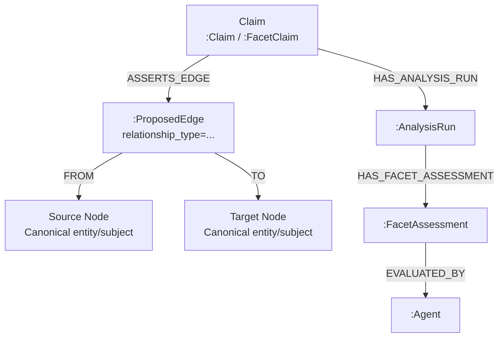

# Deep Research Critical Analysis of CHRYSTALLUM’s Scaffold‑First, Assertion‑Centric Architecture

## Executive summary

CHRYSTALLUM’s architecture—scaffold-first ingestion, evidence-aware claims, explicit agent orchestration, and promotion-gated canonicalization—maps cleanly onto modern best practices for building **trustable knowledge systems**: separate probabilistic extraction from deterministic validation, preserve provenance as a first-class concern, and enforce a hard boundary between “proposed” and “accepted” knowledge. Internally, your docs formalize this as (a) a **two-stage pipeline** where “LLMs propose; reasoning validates” before writes, and (b) a **promotion contract** that prevents scaffold artifacts from contaminating the canonical graph (Internal: *2-12-26 Chrystallum Architecture – CONSOLIDATED.md*, lines ~92–113; Internal: *2-17-26-CHRYSTALLUM_v0_AGENT_BOOTSTRAP_SPEC.md*, lines ~63–80).

The strongest technical differentiators are:

- **Audit-grade provenance in the data model**, aligned with established provenance thinking (W3C PROV’s Agent/Activity/Entity triangle) and “nanopublication-like” separation of assertion content from provenance/publication metadata. citeturn0search1turn6search1turn0search4  
- **Deterministic identity for assertions** (content-addressable claim ciphers) that supports deduplication, stable citation, and multi-agent evidence accumulation without duplicating claims (Internal: *CLAIM_ID_ARCHITECTURE.md*, lines ~44–47, ~55–85, ~82–85, ~513–531).  
- **A practical scaffold persistence design** using distinct labels (`:ScaffoldNode`, `:ScaffoldEdge`) and run scoping (`analysis_run_id`) so you can iterate safely, visualize intermediate structures, and apply capped traversal controls (Internal: *2-17-26-CHRYSTALLUM_v0_AGENT_BOOTSTRAP_SPEC.md*, lines ~74–114; Internal: *CONSOLIDATED.md*, Appendix Y lines ~15848–15885).

The main architectural risks are not conceptual—they’re **operational and economic**:

- A **reified-edge approach** (edge-as-node for `:ScaffoldEdge` and canonical `:ProposedEdge`) increases graph size and traversal complexity; you must offset this with indexing, query discipline, and selective materialization. This is manageable but must be designed intentionally (Internal: *CONSOLIDATED.md*, lines ~3863–3874, ~3913–3922; Internal: *BOOTSTRAP_SPEC*, lines ~229–243).  
- “Promotion” becomes your central control plane. If promotion tooling is weak (observability, rollback, conflict resolution), the system’s trust proposition erodes.  
- Commercially, the core value (“epistemological engine” with provenance) is compelling, especially for compliance-heavy and evidence-centric domains, but packaging must minimize deployment friction and keep LLM costs predictable; these are common failure modes for enterprise graph + agent systems.

What follows is a deeper technical and commercial dive, with explicit assumptions, diagrams, concrete schema recommendations, scaling bottlenecks, security guidance, enrichment pipelines (including Wikimedia Commons categories), and a prioritized roadmap.

## Technical deep dive

### Assumptions and scope for this analysis

Because you asked to assume “no specific constraints,” the analysis uses the following baseline assumptions:

- **Graph store**: Neo4j is the canonical store (Internal: *CONSOLIDATED.md*, lines ~79–85 mention Neo4j; multi-agent orchestration via LangGraph).  
- **Orchestration**: LangGraph is the runtime coordinator for multi-agent workflows (Internal: *CONSOLIDATED.md*, line ~80; LangGraph supports orchestrator-worker patterns and persistent state/memory). citeturn2search1turn2search9turn2search7  
- **Primary risk axis**: correctness + provenance > raw throughput; however, you still need clear scaling strategies because Neo4j transaction memory and lock behavior can become bottlenecks under heavy ingestion. citeturn2search8turn2search0turn2search10  
- **CHRYSTALLUM’s normative v0 scaffold contract** uses `:AnalysisRun` + `:ScaffoldNode` + `:ScaffoldEdge` for bootstrap, and `:Claim` + `:ProposedEdge` + `:FacetAssessment` for claim-layer evaluation (Internal: *BOOTSTRAP_SPEC* lines ~193–255; Internal: *CONSOLIDATED.md* lines ~1200–1265, ~3863–3923; Appendix Y lines ~15854–15890).

### Data flow: ingest → scaffold → promotion → canonical

Internal docs define two closely related pipelines:

- A **text/knowledge ingestion pipeline**: user input / documents → LLM extraction → deterministic validation → Neo4j write (Internal: *CONSOLIDATED.md* lines ~92–113).  
- A **subject bootstrap/scaffolding pipeline**: seed identifier → bounded expansion → scaffold persistence → promotion to canonical (Internal: *BOOTSTRAP_SPEC* lines ~83–114, ~193–243, ~259–275).

A pragmatic way to reconcile them is to treat “bootstrap scaffolding” as a *structural* acquisition pipeline and “claim extraction” as an *interpretive* acquisition pipeline, both feeding the same promotion discipline.

```mermaid
flowchart LR
  A[Input\nDocument / User Query / Seed ID] --> B[Ingestion Orchestrator\n(LangGraph)]
  B --> C[LLM Extractors / SFAs\nPropose entities, relations, claims]
  C --> D[Deterministic Validators\nSchema + authority + temporal logic]
  D --> E[Scaffold Write\n:AnalysisRun, :ScaffoldNode, :ScaffoldEdge]
  E --> F[Promotion Service\nSelection + governance + logging]
  F --> G[Canonical Graph\nEntities + Subjects + Claims + ProposedEdges]
  G --> H[Query & Reasoning\nGraph queries + RAG + UI]
```

Key architectural points:

- **Two-stage trust boundary**: The internal “LLM proposes; reasoning validates; never trust LLM output directly into the graph” principle is explicitly stated (Internal: *CONSOLIDATED.md* lines ~92–113). This is consistent with the broader engineering pattern of putting probabilistic outputs behind deterministic gates.  
- **Hard canonical/scaffold boundary**: v0 requires scaffold artifacts to be stored with scaffold-only labels so they don’t collide with canonical constraints, and it mandates promotion-gated canonicalization (Internal: *BOOTSTRAP_SPEC* lines ~63–80; Internal: *CONSOLIDATED.md* Appendix Y lines ~15848–15853).

### Schema deep dive: scaffold, claims, canonical assertions, agent metadata

#### Scaffold layer schema

From your v0 contract, the scaffold persistence model is:

- **`:AnalysisRun`** anchors a run with parameters and versioning.  
- **`:ScaffoldNode`** is unique per `(analysis_run_id, qid)` and includes `intended_label` to signal what it *might* become post-promotion.  
- **`:ScaffoldEdge`** is modeled as an **edge-as-node**, with `FROM/TO` links to `:ScaffoldNode`, and properties including `relationship_type` (the canonical rel you *would* create), plus traversal context (`hop`, `up_level`, `down_depth`, `caps_applied`, etc.).  
(Internal: *BOOTSTRAP_SPEC* lines ~193–243; Internal: *CONSOLIDATED.md* Appendix Y lines ~15854–15877.)

Recommended v0 scaffold schema table (combining what you already specify with indexing guidance):

| Object | Required fields (per v0 contract) | Strongly recommended additions | Index/constraint strategy (Neo4j) |
|---|---|---|---|
| `:AnalysisRun` | `run_id`, `pipeline_version`, `seed_qid`, `params_json`, timestamps (Internal: *BOOTSTRAP_SPEC* ~195–201) | `status`, `initiated_by_agent_id`, `environment` | Unique constraint on `run_id` (Neo4j uniqueness constraints). citeturn1search1 |
| `:ScaffoldNode` | `(analysis_run_id, qid)` identity; `wd_label`, `intended_label`, `source`, `created_at` (Internal: *BOOTSTRAP_SPEC* ~203–216) | `node_id` (deterministic), `kind_hint`, `ceiling_hit`, `not_filtered_reason` | If Enterprise: node key constraint over `(analysis_run_id,qid)`; else unique constraint on `node_id` + composite index on `(analysis_run_id,qid)`. Node keys are Enterprise-only. citeturn1search4turn1search2 |
| `:ScaffoldEdge` (edge-as-node) | `edge_id`, `analysis_run_id`, `relationship_type`, `wd_property`, `direction`, `confidence`, `created_at` + context fields (Internal: *BOOTSTRAP_SPEC* ~233–248) | `source_statement_id`, `qualifiers_json`, `truncation_note` | Unique constraint on `edge_id`; composite index on `(analysis_run_id, relationship_type)` for run-scoped queries. citeturn1search1turn1search2 |
| `(:ScaffoldEdge)-[:FROM]->(:ScaffoldNode)` and `-[:TO]->` | Required structural contract (Internal: *BOOTSTRAP_SPEC* ~229–232; Appendix Y ~15864–15866) | Consider direction normalization conventions | Relationship type privileges must exist before RBAC applies (Neo4j limitation). citeturn7search6 |

Why your edge-as-node scaffold design is strong:

- It preserves **rich context** (hops, caps, ceilings) that is hard to represent as relationship properties alone.  
- It supports **audit and replay**: “run again and compare differences” is naturally expressed with `analysis_run_id`.

The main cost is density: each “relationship” becomes **1 node + 2 relationships** plus properties, so all traversals add hops and memory overhead. This cost is real and needs explicit indexing + query discipline.

#### Canonical claim and assertion-edge schema

Your consolidated doc clarifies that **claim-layer edges** are also edge-as-node:

- `:ProposedEdge` is **canonical claim-layer structure**, asserted by a Claim using `:ASSERTS_EDGE`, and connected to endpoints via `:FROM` and `:TO`. It includes `relationship_type` to represent the semantic edge type (Internal: *CONSOLIDATED.md* lines ~3863–3874).  
- The doc explicitly distinguishes `:ProposedEdge` (claim layer) from `:ScaffoldEdge` (bootstrap scaffolding) (Internal: *CONSOLIDATED.md* lines ~3869–3875).  



This pattern is conceptually aligned with **nanopublication-style separation** (assertion graph + provenance graph + publication info graph), where *the assertion* is cleanly separable from provenance and publication metadata. citeturn0search4

#### Claim identity and versioning: content-addressable ciphers

Your Claim ID architecture states that claim ciphers should **exclude mutable provenance fields** such as confidence scores and agent/timestamp, and instead hash stable logical content + facet + temporal scope + source passage (Internal: *F/T, *CLAIM_ID_ARCHITECTURE.md* lines ~55–70, ~82–85). This design is materially important:

- It enables **deduplication across runs and agents**, because two agents asserting the same content generate the same cipher (Internal: lines ~89–95).  
- Provenance becomes additive and updateable (confidence changes, additional reviewers) without breaking identity (Internal: lines ~44–47, ~82–85).  
- It implies a natural **multi-agent claim accumulation model**, already reflected in your suggested arrays like `extracting_agents` and `extraction_timestamps` (Internal: lines ~513–531).

This aligns with PROV’s idea of stable entities and evolving provenance assertions about how they were generated or attributed. citeturn6search1turn0search1

### Storage and indexing strategies

Neo4j’s performance depends heavily on:

- using constraints/indexes for lookup-heavy operations,  
- transaction sizing (writes are kept in memory until commit),  
- avoiding unnecessary `MERGE` when you already know data is new, and  
- controlling fan-out traversals. citeturn2search8turn2search2turn6search6

#### Core index/constraint recommendations

For a scaffold-first + promotion pipeline, the heavy operations are run-scoped reads and deterministic merges.

**Constraints and constraint creation implications**: Neo4j constraint creation is atomic and requires scanning existing data; plan schema migrations carefully and schedule on low-load windows. citeturn1search1turn1search3

Recommended baseline (Neo4j Cypher; adjust version syntax as needed):

```cypher
// Canonical
CREATE CONSTRAINT claim_cipher_unique IF NOT EXISTS
FOR (c:FacetClaim) REQUIRE c.cipher IS UNIQUE;

// Scaffold
CREATE CONSTRAINT scaffold_edge_id_unique IF NOT EXISTS
FOR (e:ScaffoldEdge) REQUIRE e.edge_id IS UNIQUE;

CREATE INDEX scaffold_node_run_qid IF NOT EXISTS
FOR (n:ScaffoldNode) ON (n.analysis_run_id, n.qid);
```

This uses Neo4j’s uniqueness constraints and composite indexes. citeturn1search1turn1search2

If you run Neo4j **Enterprise**, consider **node key constraints** when you truly need composite uniqueness (e.g., `(analysis_run_id,qid)`), but note they are Enterprise-only. citeturn1search4

#### Single database with labels vs separate databases

Your v0 contract uses **distinct scaffold labels** in the same database to avoid constraint collisions (Internal: *BOOTSTRAP_SPEC* ~74–79). That is totally workable.

However, for production commercialization, it’s worth evaluating **separate databases** (or a separate DBMS) for scaffold vs canonical datasets, because Neo4j supports multiple databases per DBMS and you can manage access per database. citeturn7search3turn7search2

Tradeoffs:

- Same DB + labels: simpler operationally; but you’ll rely on label-based RBAC and “don’t query scaffold in canonical contexts” discipline.  
- Separate DBs: stronger isolation and security boundaries; enables independent lifecycle policies (e.g., automatically prune scaffolds after N days); but adds operational surface area.

### Query patterns and expected workloads

CHRYSTALLUM’s data model implies a few dominant query families:

- **Run-scoped scaffold inspection** (debuggability / explainability): “show me what the bootstrap discovered and why it stopped.”  
- **Claim evidence chain**: from a canonical fact/claim → evidence passages → agents/reviews.  
- **Subject-anchored exploration** (your “subject anchored subgraph pattern”): start at subject concepts, traverse to entities/relationships (Internal: *CONSOLIDATED.md* ~117–140).  
- **Promotion eligibility and impact**: “what would be promoted; what was filtered; what changes would occur if promoted.”

A practical way to keep performance stable is to enforce query “guardrails” similar to your Query Executor contract: always cap traversal depth and LIMIT results to prevent runaway path expansions (Internal: *BOOTSTRAP_SPEC* ~41–45).

#### Example Cypher patterns (scaffold)

Run-scoped visualization:

```cypher
MATCH (run:AnalysisRun {run_id: $runId})
MATCH (n:ScaffoldNode {analysis_run_id: $runId})
OPTIONAL MATCH (e:ScaffoldEdge {analysis_run_id: $runId})-[:FROM]->(n)-[:TO]<-[:TO]-(e2:ScaffoldEdge {analysis_run_id: $runId})
RETURN run, n
LIMIT 200;
```

Promotion candidate ranking (by density within capped run):

```cypher
MATCH (e:ScaffoldEdge {analysis_run_id: $runId})-[:FROM]->(s:ScaffoldNode)
WITH s, count(e) AS out_degree
RETURN s.qid, s.wd_label, out_degree
ORDER BY out_degree DESC
LIMIT 50;
```

This respects your v0 philosophy that density is a ranking signal, not an auto-promotion override (Internal: *BOOTSTRAP_SPEC* ~266–270; ~108–114).

#### Example Cypher patterns (canonical claim-layer)

Trace from a canonical claim to its asserted edges and endpoints:

```cypher
MATCH (c:FacetClaim {cipher: $cipher})-[:ASSERTS_EDGE]->(pe:ProposedEdge)
MATCH (pe)-[:FROM]->(src)
MATCH (pe)-[:TO]->(dst)
RETURN c, pe, src, dst;
```

This is directly grounded in your canonical claim edge pattern. (Internal: *CONSOLIDATED.md* ~3869–3873.)

### Scaling bottlenecks and performance risks

#### Bottleneck: `MERGE` on high-volume ingestion and promotion

Neo4j driver guidance notes that `MERGE` effectively does a `MATCH` + conditional `CREATE`, and can roughly double the work compared to `CREATE` when you already know data is new. citeturn2search2

Implication for CHRYSTALLUM:

- In **scaffold bootstrap**, you often know that within a run you are creating new ScaffoldNodes/Edges (except for idempotent reruns). Favor `CREATE` in run-first builds; use `MERGE` only where idempotence is required.  
- In **promotion**, `MERGE` is typically required (dedup to canonical), but you should ensure canonical ID fields (e.g., QIDs or internal IDs) are indexed, so `MERGE` becomes an index lookup rather than a label scan. citeturn6search6turn1search1

#### Bottleneck: transaction memory and oversized batch operations

Neo4j operations manual states that all modifications in a transaction are kept in memory, and very large updates should be split into several transactions to avoid running out of memory. citeturn2search8

Implication:

- Promotion jobs should be **chunked** (e.g., promote 1k edges at a time), with a resumable cursor and a `PromotionEvent` log.

#### Bottleneck: lock contention and write concurrency

Neo4j’s transactional behavior includes write locks at node/relationship levels; deadlock detection exists, but contention can still degrade throughput under concurrent writers. citeturn2search0turn2search10

Implication for multi-agent writes:

- Avoid having many agents writing to the *same hot nodes* concurrently (e.g., updating a shared “consensus score” property on a single Claim node from multiple threads). Prefer **append-only writes** (e.g., add `FacetPerspective` / `Review` nodes) and compute aggregates asynchronously, or update in a single orchestrator-controlled step.

### Consistency, replayability, and versioning

Your architecture already includes strong primitives:

- **AnalysisRun** identity + pipeline_version enables reproducibility and A/B comparisons (Internal: *CONSOLIDATED.md* ~1200–1227).  
- **Content-addressable claim IDs** keep identity stable while allowing provenance to evolve (Internal: *CLAIM_ID_ARCHITECTURE.md* ~44–47, ~55–85, ~82–85).  
- You also mention **Lamport clocks** and **Merkle roots** as verification properties in the claim model (Internal: *CONSOLIDATED.md* ~3229–3231), which is consistent with building tamper-evident audit trails.

Recommended versioning discipline:

- Treat **claims** as append-only entities except for computed fields; the claim cipher anchors identity.
- Model **reviews, endorsements, disputes** as immutable “events” (nodes) rather than overwriting claim state in-place, then derive “current status” as a view.
- Tie every produced artifact to **(run_id, agent_id, prompt_set/model_config)** so you can replicate outputs or explain drift.

This mirrors PROV’s approach: entities and activities have identifiers; provenance relations express derivation, attribution, association, delegation, etc. citeturn6search1turn0search1turn6search3

### Security and authorization

Neo4j provides role-based access control and supports a combined allowlist/denylist mechanism for privileges. citeturn1search6  
It also supports fine-grained access control patterns (e.g., deny READ of specific properties, deny TRAVERSE of relationships) which can be adapted to protect sensitive provenance fields, user identifiers, or private corpora metadata. citeturn7search4turn7search5

Critical design detail: Neo4j’s auth system only applies label/relationship/property privileges **after those labels/rel-types/property names exist**; if you rely on tight RBAC, you must ensure your schema is created (or “primed”) before deploying restrictive roles. citeturn7search6

Recommended security model for CHRYSTALLUM commercialization:

- Put scaffold data in a separate database (strongest) or at least separate labels (current v0), then:  
  - allow most users **read-only** scaffold access (or none),  
  - restrict promotion actions to a small “curator” role.
- Implement **promotion as a privileged operation** with explicit `GRANT`/`DENY` policies and immutable roles where appropriate. citeturn1search6turn7search5
- Treat LLM/API tokens and external authority API keys as secrets managed outside Neo4j; log only stable references (token ID / key alias), not raw secrets. (Industry-standard practice; implementation specifics depend on your deployment stack.)

## Agent model deep dive

### Agent types and responsibilities

Your internal architecture defines multiple agent roles:

- **Concierge/router**: routes user input and triggers bootstrap when needed (Internal: *BOOTSTRAP_SPEC* ~17–21).  
- **SCA (Subject Concierge Agent)**: one per subject area; owns scope; runs bootstrap; coordinates later tasks; must not write canonical facts except via promotion (Internal: *BOOTSTRAP_SPEC* ~24–31).  
- **SFA (Subject Facet Agents)**: propose claims and scaffold edges with provenance, but do not canonize in v0 (Internal: *BOOTSTRAP_SPEC* ~33–39).  
- **Query Executor**: safe Cypher execution with traversal caps; no mutation unless explicitly running approved procedures (Internal: *BOOTSTRAP_SPEC* ~41–45).

Your consolidated doc further describes the agent layer as graph-native reasoning actors with explicit domain scopes, memory, reasoning traces, and claim generation/review protocols (Internal: *CONSOLIDATED.md* ~2185–2194), and it explicitly documents **two-level agent routing** (FAST broad topics → LCC dynamic specialization), a strong strategy for avoiding agent proliferation while retaining expertise (Internal: ~2381–2389).

LangGraph maps neatly onto this: it explicitly supports orchestrator-worker workflows with shared state, and helps coordinate multiple worker nodes whose outputs accumulate into a shared state key. citeturn2search1turn2search7  
This reinforces an implementation where the SCA is the orchestrator and SFAs are workers.

### Identity and authentication

Your current schema treats `agent_id` as a required property on the `:Agent` node (Internal: *CONSOLIDATED.md* ~2215–2245). For commercialization, agent identity should be separated into:

- **Agent identity** (stable): `agent_id`, `agent_type`, organization, owner, etc.  
- **Execution identity** (ephemeral/contextual): runtime instance ID, model version, prompt set, environment, credential context, etc.

PROV-DM explicitly models subclasses like `prov:SoftwareAgent` and includes relations like `wasAssociatedWith` / `wasAttributedTo` / `actedOnBehalfOf` for responsibility and delegation. citeturn6search1turn6search3turn0search1  
A practical strategy is to align CHRYSTALLUM’s conceptual agent model with PROV semantics even if you store it in a property graph.

### Agent representation: node vs attribute vs hybrid

Your system already uses a hybrid tendency: agents exist as nodes (`:Agent`), but claim/cipher identity excludes agent ID, treating agent attribution as mutable provenance (Internal: *CLAIM_ID_ARCHITECTURE.md* ~82–85). That is consistent with a hybrid: stable agent identities + flexible provenance edges/attributes.

Comparison table (recommended decision: **hybrid**):

| Approach | How it looks | Pros | Cons | Best fit |
|---|---|---|---|---|
| Agent as attribute | `(:Claim {created_by_agent:"A"})`, or `[:REL {asserted_by:"A"}]` | Fast/simple; fewer nodes; easy to query by property | Poor for multi-agent assertions (arrays get messy); weak for rich identity/auth; hard to model delegation & endorsement; risk of hot-spot updates | Small prototypes; single-writer systems |
| Agent as node | `(:Claim)-[:ATTRIBUTED_TO]->(:Agent)` | Rich identity, roles, delegation; clean provenance modeling; aligns with PROV conceptual graph | More joins/hops; requires indexing and careful query shapes | Enterprise provenance, audit trails, multi-actor systems |
| Hybrid | Agent nodes + “assertion events” or `FacetPerspective` nodes representing per-agent contribution | Best of both: rich agent identities + append-only provenance events; reduces hot-node contention; scales multi-agent consensus | More modeling complexity; must standardize conventions | CHRYSTALLUM’s multi-agent, evidence-centric goals |

Given your multi-agent evaluation pattern (`:FacetAssessment -[:EVALUATED_BY]-> :Agent`) and suggested `FacetPerspective` attachments (Internal: *CONSOLIDATED.md* ~2556–2570; ~1260–1265), hybrid is the cleanest “future-proof” choice.

### Provenance capture and multi-agent assertions

Your Claim ID design explicitly states provenance is stored separately from the stable cipher and can accumulate across agents (Internal: *CLAIM_ID_ARCHITECTURE.md* ~44–47, ~89–95, ~513–531). This naturally supports multi-agent assertions and consensus.

A robust canonical implementation pattern is:

- **Claim** (`:FacetClaim`) is stable by cipher.
- Each agent contribution is a **separate node** (or relationship instance) that records agent, time, confidence, rationale, and trace pointers:
  - `:FacetPerspective` (already in your consolidated doc as the mechanism for multi-agent enrichment; Internal: *CONSOLIDATED.md* ~2556–2570)
  - and/or `:Review` nodes for validation decisions.

This avoids contention from multiple agents updating fields on a single claim node concurrently (see Neo4j lock behavior). citeturn2search10

### Dispute and endorsement modeling

Your design already anticipates “challenged/uncertain” evaluation states in `FacetAssessment` (Internal: *CONSOLIDATED.md* ~1237–1241). Extend this systematically:

- **Endorsement** = an agent issues a `Review`/`FacetAssessment` with status “supported” plus evidence pointers.
- **Dispute** = an agent issues a `Review`/`FacetAssessment` with status “challenged,” optionally referencing counter-evidence or a competing claim cipher.
- **Delegation** = SCA delegates to SFA; modelable as `actedOnBehalfOf` conceptually (PROV) or as a CHRYSTALLUM edge like `(:Agent)-[:DELEGATED_TO]->(:Agent)` plus `run_id` context. citeturn6search1turn6search3

### Recommended agent and provenance data model

Below is a recommended minimal schema that is implementable in Neo4j and aligns with your existing v0 patterns.

**Agent node (`:Agent`)**

| Field | Type | Notes |
|---|---|---|
| `agent_id` | string (unique) | Stable identity (Internal: agent schema). |
| `agent_type` | enum (`subject`,`facet`,`entity`,`coordinator`,`human`,`service`) | Expand beyond v0 triad to cover humans and system services. |
| `label` | string | Display name. |
| `version` | string | Agent spec version (Internal: agent optional props). |
| `capabilities` | string[] | E.g., `["bootstrap","validate","promote"]`. |
| `owner_org` | string | For commercial multi-tenant support. |
| `created_at` | datetime | Operational. |

**Agent execution context (`:AgentRun` or properties on `:FacetPerspective`/`:Review`)**

| Field | Type | Notes |
|---|---|---|
| `run_instance_id` | string | Unique per runtime invocation. |
| `analysis_run_id` | string | Tie to `:AnalysisRun`. |
| `model_provider` | string | If LLM-powered. |
| `model_name` | string | E.g., GPT model name. |
| `prompt_set` | string | Internal prompt bundle ID (Internal: `AnalysisRun.prompt_set`). |
| `toolchain_version` | string | Pipelines/validators version. |

**Per-assertion provenance node (`:FacetPerspective` or `:AssertionProvenance`)**

| Field | Type | Notes |
|---|---|---|
| `perspective_id` | string | Unique. |
| `claim_cipher` | string | Link to claim. |
| `agent_id` | string | Source agent. |
| `confidence` | float | Mutable per agent; not part of cipher. |
| `timestamp` | datetime | |
| `rationale` | string | Human-readable. |
| `reasoning_trace_id` | string | Link to `:ReasoningTrace`. |

This aligns with your documented FacetPerspective rationale: one claim node, multiple perspectives, consensus calculation over perspectives (Internal: *CONSOLIDATED.md* ~2567–2570).

## Operational concerns

### Monitoring and observability

You need observability at three layers:

- **Graph DB health + performance** (transactions, locks, page cache, query latency)  
- **Agent runtime health** (timeouts, failure rates, retries, token costs)  
- **Promotion safety** (how many promoted, errors, rollback triggered)

Neo4j can be monitored via metrics and can integrate with Prometheus (Neo4j KB describes configuration of the Prometheus endpoint). citeturn6search4  
Neo4j query tuning should rely on `EXPLAIN`/`PROFILE` to ensure index usage and minimize rows processed. citeturn6search6

### Audit trails, lineage, and rollback

Your architecture is inherently audit-friendly if you consistently log:

- `AnalysisRun` parameters and versions (Internal: *BOOTSTRAP_SPEC* ~195–২০১; Internal: *CONSOLIDATED.md* ~1206–1214).  
- `ReasoningTrace` per agent decision (Internal: *CONSOLIDATED.md* ~3929–3940).  
- `PromotionEvent` records linking promoted artifacts to `analysis_run_id` and source scaffolds (Internal: *BOOTSTRAP_SPEC* ~271–275; Internal: *CONSOLIDATED.md* Appendix Y ~15892–15899).

**Rollback strategy** should be event-driven:

- Promotion should be **idempotent** (safe to re-run) and reversible.  
- Record a `PromotionEvent` that lists created node IDs / edge IDs (or stores a queryable tag like `promoted_by_event_id`).  
- Rollback becomes: “delete everything with `promoted_by_event_id = X`” (plus restore superseded pointers if you model `SUPERSEDES`).

This fits Neo4j’s transactional discipline: transactions can be committed/rolled back, and large updates should be chunked to avoid memory issues. citeturn2search8turn2search0

### Conflict resolution

You already have the structural beginnings:

- Multi-agent assessments (`FacetAssessment` with independent facet evaluation and `EVALUATED_BY`) (Internal: *CONSOLIDATED.md* ~1237–1265).  
- Multi-agent perspectives on claims (FacetPerspective justification; Internal: *CONSOLIDATED.md* ~2556–2570).  
- Stable ciphers enable detecting “same claim, different provenance” rather than duplicating nodes (Internal: *CLAIM_ID_ARCHITECTURE.md* ~89–95).

To make conflict resolution operationally robust:

- Treat “truth” in canonical graph as **derived**: e.g., promote only when consensus_score crosses threshold + governance rules pass.  
- Keep conflicting claims in the claim layer; do not overwrite canonical facts without recording supersession.

### CI/CD for schema evolution

Neo4j constraints and indexes are schema-level operations that can be costly (atomic scan), so use controlled migrations. citeturn1search1turn1search3

Practical CI/CD discipline:

- Version schema migrations in source control (e.g., timestamped Cypher migration files).  
- In CI, run a **migration test** against a fresh Neo4j instance.  
- Use `IF NOT EXISTS` patterns for idempotent deploys where supported. citeturn1search0turn1search1  
- Gate production promotion tooling behind feature flags until schema is proven.

## Integration and enrichment

### Why external taxonomies can help scaffolding

Your proposal to scaffold from Wikimedia Commons **politics** category structures is interesting precisely because your v0 scaffolding model is designed to ingest **large, noisy graphs under caps and filters**, then selectively promote what is governed.

However, note a key tension: your current bootstrap spec explicitly includes “Wikimedia categories” in NOT filters for promotion/expansion in the Wikidata bootstrap context (Internal: *BOOTSTRAP_SPEC* ~102–106). The reason is sound: Wikimedia categories often behave as editorial containers and indices, not stable domain entities.

The right approach is to treat Commons categories as:

- an **external taxonomy signal** (good for enrichment/labeling),  
- but **not** inherently canonical entities unless mapped to an approved authority (FAST/LCSH/Wikidata topic item) and governed through promotion review.

### Wikimedia Commons categories as a taxonomy source

MediaWiki categories are an indexing system; category pages contain lists of pages/files/subcategories, and the category structure is often a graph (not a strict tree). citeturn3search1  
Programmatically, you can enumerate category members using the MediaWiki Action API `list=categorymembers` with parameters like `cmtitle`, `cmtype=subcat|file|page`, etc. citeturn0search0

The Commons category `Category:Politics` contains subcategories and a small set of files. citeturn4search6  
Importantly, Commons also has “index/longlist” categories, e.g., `Category:Politics by topic`, which explicitly says it is not a normal category and allows overcategorization as an index list. citeturn4search4  
This is a strong signal that you must detect and treat these categories differently in enrichment pipelines.

### Mapping heuristics: Commons category → canonical SubjectConcept

A practical mapping pipeline:

1. **Ingest category graph into scaffold**  
   - Create `:ScaffoldNode` with `kind_hint = "commons_category"` and `source = "commons_api"`.  
   - Use `analysis_run_id` and caps similar to your v0 defaults (depth and per-node caps). (This is consistent with your approach for Wikidata bootstrap caps; Internal: *BOOTSTRAP_SPEC* ~93–114.)

2. **Resolve category to Wikidata topic when possible**  
   Use Wikidata properties designed to connect topics ↔ categories:  
   - `Commons category (P373)` stores the name of the Commons category related to a topic item. citeturn3search3  
   - `topic's main category (P910)` links a topic to its main Wikimedia category. citeturn3search0  
   These properties help build a “category ↔ topic item” join layer that anchors semantics beyond editorial category structure.

3. **Normalize category names to candidate SubjectConcepts**  
   - Strip “Category:” prefix; decode underscores; remove disambiguation suffixes (e.g., “(politics)”) into qualifiers.  
   - Detect index categories (like “by topic”) and tag `kind_hint="index_category"`; treat as navigation aids, not ontology nodes. citeturn4search4turn3search1  

4. **Crosswalk to your authorities**  
   - If there is a Wikidata topic match, try mapping to your preferred authorities (LCSH/FAST/LCC) via your existing authority federation strategy (as described conceptually in your consolidated architecture). (Internal: *CONSOLIDATED.md* describes multi-authority alignment; lines ~170–210.)  
   - Otherwise, keep as a “local provisional SubjectConcept” in scaffold and require review before promotion.

#### Example enrichment mapping (heuristic)

- Commons: `Category:Politics by location` → detect “by location” = facet dimension + geographic qualifier; likely maps to your **facet system** (POLITICAL + GEOGRAPHIC) rather than a single subject node. citeturn4search5  
- Create or enrich `:SubjectConcept {facet:"POLITICAL"}` with a relationship to geographic facet concepts (consistent with your facet/subject layering; Internal: *CONSOLIDATED.md* ~1290–1294 and subject layer definitions).

### Automated enrichment pipeline design

A safe enrichment pipeline should be:

- **Scaffold-first**: import and label signals without committing canonical truth.
- **Capped**: avoid huge category explosions; MediaWiki categories can scale massively.
- **Governed**: promotion requires filters/meta-ceilings and logged truncation reasons (Internal: *BOOTSTRAP_SPEC* ~93–114; Appendix Y ~15880–15884).

This is directly aligned with your v0 bootstrap policies: caps like `per_node_neighbor_cap`, NOT filters, and explicit truncation logging. (Internal: *BOOTSTRAP_SPEC* ~93–114.)

## Commercial analysis

### Where CHRYSTALLUM’s value is strongest

Your internal positioning frames CHRYSTALLUM as an “epistemological engine” for building verifiable knowledge from text, not merely a history tool (Internal: *CONSOLIDATED.md* ~1.5+ sections). That positioning is commercially credible because provenance + explainability is a persistent pain point in enterprise AI.

High-value segments (in descending order of willingness-to-pay, typically):

- **Legal / eDiscovery / investigations**: evidence chains, citations, explainability.  
- **Intelligence & security analysis**: provenance, source weighting, competing hypotheses.  
- **Regulated enterprise knowledge** (finance, healthcare compliance): audit trails and policy gates.  
- **R&D knowledge management** (pharma, biotech): traceable claims and competing interpretations.

Neo4j itself markets graph databases for fraud detection and MDM—both are large enterprise markets where “connected data + governance” matters. citeturn5search2turn5search0  
These are adjacent to (and often overlap with) provenance-heavy knowledge graph needs.

### Competitive landscape

You face two overlapping competitive sets:

**Graph infrastructure vendors** (your “platform substrate competitors”)

- Neo4j (property graph, Cypher, enterprise security and ACID transactions). citeturn2search0turn1search6  
- Amazon Neptune (managed graph, supports Gremlin, SPARQL, openCypher; bulk loading). citeturn5search4  
- RDF-centric / semantic vendors: Ontotext GraphDB (RDF/SPARQL, reasoning features) citeturn5search1turn5search8 and Stardog (knowledge catalog / virtualization). citeturn5search3  

**Agentic data/knowledge tooling** (your “workflow competitors”)

- LangGraph and related orchestrators: LangGraph emphasizes controllable workflows, memory, and orchestrator-worker patterns. citeturn2search9turn2search1  
- Many teams will attempt to build “good enough” provenance around RAG systems without a full promotion-governed graph.

How CHRYSTALLUM differentiates:

- Not “a graph DB,” but a **methodology + data model + governance layer**: scaffold, claims, provenance, promotion, and agent coordination are bundled as a coherent epistemic workflow.
- Your content-addressable claim identity and separation of provenance is a meaningful differentiator for multi-agent consensus and citation stability (Internal: *CLAIM_ID_ARCHITECTURE.md* ~44–47, ~55–85, ~89–95).

### Packaging and pricing options

Given current architecture shape, three packaging models are plausible:

- **SaaS (hosted CHRYSTALLUM)**: you operate the orchestration + graph; customers bring data; you sell seats + usage (runs, tokens, graph size). Best for mid-market, but requires strong security and tenant isolation (Neo4j multi-db and RBAC help). citeturn7search3turn1search6  
- **Enterprise software (BYO Neo4j/AWS)**: sell annual licenses + support; deploy in customer VPC/on-prem. Best for regulated customers; longer sales cycles.  
- **Open-core**: open schema + basic ingestion scaffolding; monetize premium modules: promotion governance, connectors, compliance features, UI, monitoring, advanced enrichment.

Pricing dimensions that map to your architecture:

- Number of **active subjects/SCAs** (domains)  
- Volume of **AnalysisRuns / promotions**  
- Total **claims** and **evidence passages** ingested  
- **Agent orchestration** tier (basic vs advanced consensus/dispute workflows)  
- Compliance add-ons (audit exports, PROV/RDF export, immutable retention)

### Go-to-market risks

Key commercialization risks specific to scaffold-first/promotion-governed systems:

- **Time-to-value**: if customers can’t see value before a full ontology/authority integration, the sales cycle stalls. Scaffold visualization and incremental “promotion wins” are critical.  
- **Operational burden**: promotion governance requires tooling (UI, reviews, rollback) or customers will treat it as “too heavy.”  
- **LLM cost predictability**: token costs can explode without strict caps, caching, and dedup; your run caps and content-addressable identity are major mitigations (Internal: *BOOTSTRAP_SPEC* ~93–114; *CLAIM_ID_ARCHITECTURE.md* ~89–95).  
- **Data rights/licensing**: enrichment from Wikimedia/Commons is powerful but must respect licensing/attribution regimes; Wikidata structured data is CC0 per Wikidata pages, but media files have per-file licenses—your pipeline should distinguish taxonomy metadata (safe) from content reuse (requires license handling). citeturn3search3turn4search6

## Roadmap and recommendations

### Prioritized milestones

The roadmap below assumes you want to productize v0 into a commercial-grade v1 while preserving the architecture’s epistemic trust guarantees.

| Horizon | Milestone | What “done” looks like | Effort | Risk |
|---|---|---|---|---|
| Short term | Promotion service MVP | Deterministic promotion from `:ScaffoldEdge` → canonical nodes + `:ProposedEdge`; logs `PromotionEvent`; supports rollback by event tag | Medium | Medium |
| Short term | Observability baseline | Metrics for run throughput, promotion counts, query latency; dashboards; alerting; query profiling playbook | Medium | Low |
| Short term | Agent provenance normalization | Standardize `AgentRun` or `FacetPerspective`/`Review` event schema; eliminate hot-node updates; consensus computed asynchronously | Medium | Medium |
| Medium term | Conflict/dispute workflows | UI or API for “supported/challenged/uncertain”; competing claims; endorsement/dispute relations; governance thresholds | High | Medium |
| Medium term | External taxonomy enrichment pack | Commons categories + Wikidata category/topic mapping, with caps and index-category detection | Medium | Medium |
| Medium term | Security hardening | RBAC roles for reader/reviewer/promoter; separate scaffold DB optional; audit export | Medium | Medium |
| Long term | Multi-tenant SaaS readiness | Tenant isolation, per-tenant resource caps, billing metrics; secure connectors | High | High |
| Long term | Standards export | PROV-O / Nanopublication-compatible RDF export to support interoperability | Medium | Medium |

### Team skills required

To execute this roadmap efficiently, you want explicit coverage in:

- Neo4j data modeling + performance tuning (indexes, query plans, transaction sizing) citeturn1search2turn2search8turn6search6  
- Provenance modeling (W3C PROV; event sourcing mindset) citeturn6search1turn0search1  
- Agent orchestration engineering (LangGraph patterns, supervisor/worker, memory/state design) citeturn2search1turn2search9  
- Data governance/product design (promotion UX, review flows, audit exports)  
- Security engineering (RBAC, fine-grained restrictions, secret handling) citeturn1search6turn7search4

### Actionable next steps

- Implement a **PromotionEvent** node + “promotion tagging” pattern immediately, because it unlocks rollback, auditing, and safe iteration (Internal: *BOOTSTRAP_SPEC* ~271–275; Appendix Y ~15895–15899).  
- Decide whether scaffold should remain **label-isolated** or move to a **separate database** for tenant/security clarity; Neo4j multi-database support makes this feasible. citeturn7search3turn7search2  
- Make multi-agent provenance **append-only**: use `FacetPerspective`/`Review` event nodes instead of updating claim properties under contention (Internal: *CONSOLIDATED.md* ~2556–2570; Neo4j lock behavior). citeturn2search10  
- Add a formal **index-category detector** for Commons enrichment (because Commons explicitly contains index/longlist categories, e.g., “Politics by topic”). citeturn4search4turn3search1  
- Establish a “query discipline” guide for developers using `EXPLAIN/PROFILE` and index-first query patterns. citeturn6search6

## Key implementation snippets

### Agent as node

```cypher
CREATE CONSTRAINT agent_id_unique IF NOT EXISTS
FOR (a:Agent) REQUIRE a.agent_id IS UNIQUE;

MERGE (a:Agent {agent_id: $agentId})
SET a.label = $label,
    a.agent_type = $agentType,
    a.version = $version;
```

### Agent as edge attribute

```cypher
MATCH (s:Human {entity_id: $sid}), (t:Organization {entity_id: $tid})
MERGE (s)-[r:CHALLENGED_AUTHORITY_OF]->(t)
SET r.asserted_by = $agentId,
    r.asserted_at = datetime(),
    r.confidence = $confidence;
```

### Hybrid: claim cipher + FacetPerspective (append-only provenance)

```cypher
// Claim is stable by cipher
MERGE (c:FacetClaim {cipher: $cipher})
ON CREATE SET c.created_at = datetime(), c.facet_id = $facetId
SET c.last_seen_at = datetime();

// Append-only provenance event
CREATE (p:FacetPerspective {
  perspective_id: $perspId,
  agent_id: $agentId,
  confidence: $confidence,
  created_at: datetime(),
  rationale: $rationale
})
MERGE (p)-[:PERSPECTIVE_ON]->(c);
```

This matches your documented “FacetPerspective attached to Claim” approach and avoids overwriting claim identity. (Internal: *CONSOLIDATED.md* ~2556–2570; *CLAIM_ID_ARCHITECTURE.md* ~44–47, ~82–85.)

### Promotion: scaffold edge → canonical proposed edge

```cypher
// Promote a single scaffold edge into a canonical ProposedEdge asserted by a Claim
MATCH (se:ScaffoldEdge {edge_id: $edgeId})-[:FROM]->(sn:ScaffoldNode)
MATCH (se)-[:TO]->(on:ScaffoldNode)

// Canonical endpoints (example assumes qid-based canonical nodes exist or are created)
MERGE (src:SubjectConcept {qid: sn.qid})
ON CREATE SET src.label = sn.wd_label

MERGE (dst:SubjectConcept {qid: on.qid})
ON CREATE SET dst.label = on.wd_label

// Create or link the Claim (cipher computed upstream)
MERGE (c:FacetClaim {cipher: $claimCipher})

// ProposedEdge is canonical claim-layer edge-as-node (per your contract)
MERGE (pe:ProposedEdge {edge_id: $proposedEdgeId})
SET pe.relationship_type = se.relationship_type,
    pe.created_at = datetime(),
    pe.analysis_run_id = se.analysis_run_id

MERGE (c)-[:ASSERTS_EDGE]->(pe)
MERGE (pe)-[:FROM]->(src)
MERGE (pe)-[:TO]->(dst);
```

This is directly aligned with your canonical `:ProposedEdge` pattern and the scaffold contract distinction (`ScaffoldEdge` vs `ProposedEdge`). (Internal: *CONSOLIDATED.md* ~3869–3875; Appendix Y ~15854–15877.)

### SQL audit log (optional, for external audit warehouse)

```sql
CREATE TABLE promotion_event (
  promotion_event_id TEXT PRIMARY KEY,
  analysis_run_id TEXT NOT NULL,
  promoted_by_agent_id TEXT NOT NULL,
  promoted_at TIMESTAMP NOT NULL,
  promoted_nodes_count INTEGER NOT NULL,
  promoted_edges_count INTEGER NOT NULL,
  notes TEXT
);
```

### PROV-O / nanopublication-aligned RDF sketch

This mirrors nanopublication guidance: an assertion graph plus provenance and publication info graphs, using PROV relations. citeturn0search4turn0search1turn6search3

```turtle
@prefix prov: <http://www.w3.org/ns/prov#> .
@prefix np:   <http://www.nanopub.org/nschema#> .
@prefix ex:   <http://example.org/> .
@prefix dct:  <http://purl.org/dc/terms/> .

ex:nanopub1 a np:Nanopublication ;
  np:hasAssertion ex:assertion ;
  np:hasProvenance ex:provenance ;
  np:hasPublicationInfo ex:pubinfo .

# Assertion graph
ex:assertion {
  ex:claim123 ex:relationshipType "CHALLENGED_AUTHORITY_OF" ;
              ex:from ex:Caesar ;
              ex:to ex:RomanSenate .
}

# Provenance graph
ex:provenance {
  ex:assertion prov:wasAttributedTo ex:agent_political_sfa_001 ;
               prov:wasDerivedFrom ex:passage_plutarch_caesar_32 .
}

# Publication info graph
ex:pubinfo {
  ex:nanopub1 dct:created "2026-02-17T12:00:00Z"^^<http://www.w3.org/2001/XMLSchema#dateTime> .
}
```

## References

Primary standards and provenance models:

- W3C PROV-O (PROV ontology) citeturn0search1  
- W3C PROV-DM (PROV data model) citeturn6search1  
- PROV namespace definitions (e.g., `wasGeneratedBy`, `wasDerivedFrom`, `wasAttributedTo`) citeturn6search3  
- Nanopublication guidelines (assertion/provenance/publication info graphs) citeturn0search4  

Graph database implementation and governance:

- Neo4j constraints (creation, atomic scan implications, idempotence with `IF NOT EXISTS`) citeturn1search1turn1search0  
- Neo4j composite indexes citeturn1search2  
- Neo4j node key constraints (Enterprise) citeturn1search4  
- Neo4j ACID transactions, locking, and default isolation semantics citeturn2search0turn2search10turn2search8  
- Neo4j performance: MERGE vs CREATE guidance (driver manual) citeturn2search2  
- Neo4j query best practices: `EXPLAIN`/`PROFILE` and index usage citeturn6search6  
- Neo4j RBAC and fine-grained access control citeturn1search6turn7search4turn7search5  
- Neo4j multi-database and database administration concepts citeturn7search3turn7search2  
- Neo4j monitoring with Prometheus (Neo4j KB) citeturn6search4  

Agent orchestration:

- LangGraph orchestrator-worker workflows and state accumulation citeturn2search1turn2search7  
- LangGraph product overview (memory, human-in-the-loop controls) citeturn2search9  

External taxonomies / enrichment sources:

- MediaWiki categories overview (graph-like category hierarchies) citeturn3search1  
- MediaWiki Action API `categorymembers` citeturn0search0  
- Wikimedia Commons Category:Politics citeturn4search6  
- Wikimedia Commons Category:Politics by topic (explicitly an index/longlist) citeturn4search4  
- Wikidata properties for linking topics ↔ categories: P373 and P910 citeturn3search3turn3search0  

Competitive/reference platforms:

- AWS Neptune feature overview (Gremlin/SPARQL/openCypher; bulk loading) citeturn5search4  
- Stardog Knowledge Catalog docs citeturn5search3  
- Ontotext GraphDB product/docs (RDF/SPARQL positioning) citeturn5search1turn5search8  
- Neo4j enterprise use-case positioning (MDM, fraud detection) citeturn5search0turn5search2