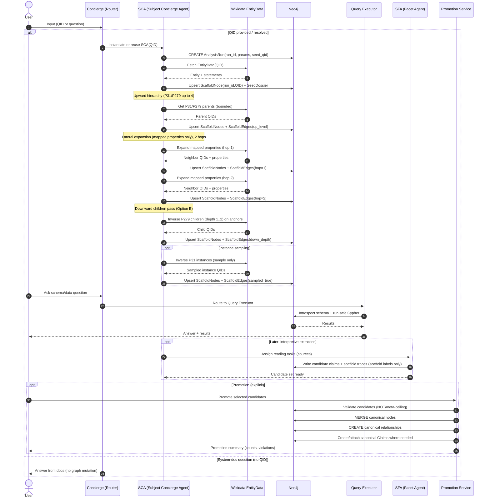

# Sequence Diagram (Agents, v0 Bootstrap Contract)

```mermaid
sequenceDiagram
  autonumber
  actor User
  participant Concierge as Concierge (Router)
  participant SCA as SCA (Subject Concierge Agent)
  participant WD as Wikidata EntityData
  participant Neo as Neo4j
  participant Exec as Query Executor
  participant SFA as SFA (Facet Agent)
  participant Promote as Promotion Service

  User->>Concierge: Input (QID or question)
  alt QID provided / resolved
    Concierge->>SCA: Instantiate or reuse SCA(QID)
    SCA->>Neo: CREATE AnalysisRun(run_id, params, seed_qid)
    SCA->>WD: Fetch EntityData(QID)
    WD-->>SCA: Entity + statements
    SCA->>Neo: Upsert ScaffoldNode(run_id,QID) + SeedDossier

    Note over SCA: Upward hierarchy (P31/P279 up to 4)
    SCA->>WD: Get P31/P279 parents (bounded)
    WD-->>SCA: Parent QIDs
    SCA->>Neo: Upsert ScaffoldNodes + ScaffoldEdges(up_level)

    Note over SCA: Lateral expansion (mapped properties only), 2 hops
    SCA->>WD: Expand mapped properties (hop 1)
    WD-->>SCA: Neighbor QIDs + properties
    SCA->>Neo: Upsert ScaffoldNodes + ScaffoldEdges(hop=1)
    SCA->>WD: Expand mapped properties (hop 2)
    WD-->>SCA: Neighbor QIDs + properties
    SCA->>Neo: Upsert ScaffoldNodes + ScaffoldEdges(hop=2)

    Note over SCA: Downward children pass (Option B)
    SCA->>WD: Inverse P279 children (depth 1..2) on anchors
    WD-->>SCA: Child QIDs
    SCA->>Neo: Upsert ScaffoldNodes + ScaffoldEdges(down_depth)

    opt Instance sampling
      SCA->>WD: Inverse P31 instances (sample only)
      WD-->>SCA: Sampled instance QIDs
      SCA->>Neo: Upsert ScaffoldNodes + ScaffoldEdges(sampled=true)
    end

    User->>Concierge: Ask schema/data question
    Concierge->>Exec: Route to Query Executor
    Exec->>Neo: Introspect schema + run safe Cypher
    Neo-->>Exec: Results
    Exec-->>User: Answer + results

    opt Later: interpretive extraction
      SCA->>SFA: Assign reading tasks (sources)
      SFA->>Neo: Write candidate claims + scaffold traces (scaffold labels only)
      SFA-->>SCA: Candidate set ready
    end

    opt Promotion (explicit)
      User->>Promote: Promote selected candidates
      Promote->>Neo: Validate candidates (NOT/meta-ceiling)
      Promote->>Neo: MERGE canonical nodes
      Promote->>Neo: CREATE canonical relationships
      Promote->>Neo: Create/attach canonical Claims where needed
      Promote-->>User: Promotion summary (counts, violations)
    end

  else System-doc question (no QID)
    Concierge-->>User: Answer from docs (no graph mutation)
  end
```
