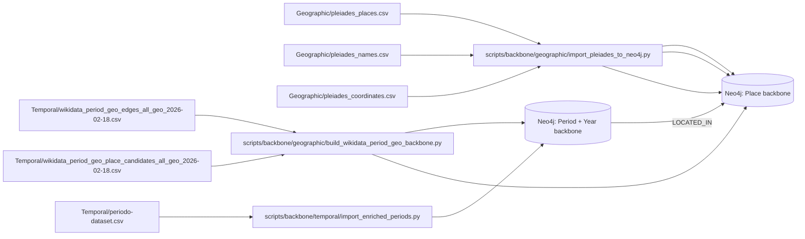

# Temporal + Geo Backbone Model (Working Spec)

Date: 2026-02-18
Status: Working outline for slow-step alignment

## 1) Operating Rule (Agreed)

- `SCA` behavior:
  - On initial entity/place ingest, set `temporal_tag = 'unknown'`.
  - Do not force historical/modern classification at seed time.
- `SFA` behavior:
  - Resolve period context from facet evidence.
  - Update/append period context and confidence from facet perspective.

This avoids early hard-coding of temporal assumptions.

## 2) Temporal Backbone Outline

Canonical temporal backbone currently implemented:

- Nodes:
  - `:Year`
  - `:Decade`
  - `:Century`
  - `:Millennium`
  - `:Period` (with `node_type='periodO'` in current PeriodO pipeline)
- Core temporal relationships:
  - `(:Year)-[:FOLLOWED_BY]->(:Year)`
  - `(:Year)-[:PART_OF]->(:Decade)`
  - `(:Decade)-[:PART_OF]->(:Century)`
  - `(:Century)-[:PART_OF]->(:Millennium)`
  - `(:Period)-[:STARTS_IN_YEAR]->(:Year)` (target canonical)
  - `(:Period)-[:ENDS_IN_YEAR]->(:Year)` (target canonical)
  - `(:Period)-[:PART_OF]->(:Period)` (canonical hierarchy edge)
  - `(:Period)-[:SUB_PERIOD_OF]->(:Period)` (compat alias edge)
  - `(:Period)-[:BROADER_THAN]->(:Period)` (semantic convenience edge, derived)
  - `(:Period)-[:NARROWER_THAN]->(:Period)` (semantic convenience edge, derived)

Temporal ingest policy in current filtered build:

- Must have PeriodO federation id.
- Must have both start and end years.
- Must pass cutoff filter (`end_year < -2000` for the current cohort).
- Must have non-empty spatial coverage text.

Period hierarchy normalization policy:

- Canonical write path:
  - child `PART_OF` parent
- Compatibility / query-support edges:
  - child `SUB_PERIOD_OF` parent
  - parent `BROADER_THAN` child
  - child `NARROWER_THAN` parent
- Rule:
  - `BROADER_THAN/NARROWER_THAN` must be derivable from `PART_OF` and never contradict it.

Period scope classification policy (span-based baseline):

- `span_years = end_year - begin_year` (adjusted for no year 0 crossing)
- `granularity_class = universal` when `span_years >= threshold`
- `granularity_class = granular` when `span_years < threshold`
- Default threshold: `1000` years (configurable at import)
- Operational rule:
  - SCA keeps `temporal_tag='unknown'`
  - SFA may confirm/override classification with evidence

## 3) Geo Backbone Outline

Canonical geo backbone currently implemented:

- Node:
  - `:Place`
- Core spatial relationships:
  - `(:Place)-[:LOCATED_IN]->(:Place)` for place hierarchy (currently from Wikidata `P131`).
  - `(:Period)-[:LOCATED_IN]->(:Place)` for period-to-place linkage.

Authority layers presently in graph:

- `Pleiades` places (major volume).
- `Wikidata` place backbone (normalized seed set from period geo candidates).

No-country-link handling (important triage case):

- Condition:
  - Place candidate has label/alias or geo signal, but no direct country link (`P17` missing or unresolved).
- Handling:
  - Route to SCA/SFA triage queue as `geo_resolution_needed`.
  - SCA keeps conservative defaults (`temporal_tag='unknown'`, unresolved place role).
  - SFA (facet-aware) determines whether candidate behaves as:
    - `Place`
    - `Period-like region`
    - or another semantic role needing remap.
- Output:
  - Canonical node/edge decision + provenance note (why country linkage was absent).

## 4) Visual Model: Backbone Graph Shape

```mermaid
graph TD
  Y[Year] -->|PART_OF| D[Decade]
  D -->|PART_OF| C[Century]
  C -->|PART_OF| M[Millennium]
  Y -->|FOLLOWED_BY| Y2[Year]

  P[Period]
  P -->|STARTS_IN_YEAR| Y
  P -->|ENDS_IN_YEAR| Y2
  P -->|PART_OF (canonical)| P2[Period]
  P -->|SUB_PERIOD_OF / BROADER_THAN / NARROWER_THAN (derived+compat)| P3[Period]

  PL[Place]
  PL -->|LOCATED_IN| PL2[Place]
  P -->|LOCATED_IN| PL

  SCA[SCA Seed Pass]
  SFA[SFA Facet Pass]
  SCA -->|set temporal_tag=unknown| P
  SFA -->|assign facet period context + confidence| P
```

## 5) Visual Model: Dataset-to-Graph Pipeline



## 6) Current Snapshot (Items Only)

Graph components currently present:

- Temporal backbone nodes:
  - `:Year`
  - `:Decade`
  - `:Century`
  - `:Millennium`
  - `:Period` (`node_type='periodO'`)
- Temporal backbone edges:
  - `FOLLOWED_BY`
  - `PART_OF` (Year -> Decade -> Century -> Millennium)
  - `BROADER_THAN`
  - `NARROWER_THAN`
  - `STARTS_IN_YEAR` (known gap in current materialization)
  - `ENDS_IN_YEAR` (known gap in current materialization)
- Geo backbone nodes:
  - `:Place` (`authority='Pleiades'`)
  - `:Place` (`node_type='wikidata_place_backbone'`)
- Geo backbone edges:
  - `(:Place)-[:LOCATED_IN]->(:Place)`
  - `(:Period)-[:LOCATED_IN]->(:Place)` (partial)

Source artifacts in active pipeline:

- Geographic source artifacts:
  - `Geographic/pleiades_places.csv`
  - `Geographic/pleiades_names.csv`
  - `Geographic/pleiades_coordinates.csv` (currently sparse; repair required)
- Temporal source artifacts:
  - `Temporal/periodo-dataset.csv`
  - `Temporal/periodo_filtered_end_before_minus2000.csv`
  - `Temporal/periodo_filtered_end_before_minus2000_with_geography.csv`
- Wikidata geo normalization artifacts:
  - `Temporal/wikidata_period_geo_edges_all_geo_2026-02-18.csv`
  - `Temporal/wikidata_period_geo_place_candidates_all_geo_2026-02-18.csv`
  - `Temporal/wikidata_period_geo_place_normalization_report_2026-02-18.csv`
- Expanded SCA simulation artifacts:
  - `Temporal/wikidata_period_sca_expanded_feature_bag_2026-02-18.csv`
  - `Temporal/wikidata_period_sca_categorization_2026-02-18.csv`
  - generated by `scripts/backbone/geographic/simulate_sca_qid_categorization.py`

Representative row items (dataset examples):

- `Geographic/pleiades_places.csv`:
  - `48210385 | Borgo Medievale | settlement | 640..1453`
  - `48210386 | Tempio Grande at Vulci | temple-2 | -750..300`
  - `265876 | Consabura/Consabrum | settlement | -330..2099`
- `Geographic/pleiades_names.csv`:
  - `265876 | Consaburrenses | la`
  - `265877 | Contestania | la`
- `Geographic/pleiades_coordinates.csv`:
  - `/places/48210385 | OSM location of Borgo Medievale | 42.082885,13.4119837`
  - `/places/265876 | DARMC location 20192 (modern Consuegra) | 39.460299,-3.606772`
- `Temporal/periodo_filtered_end_before_minus2000_with_geography.csv`:
  - `p0qhb66zdzz | Vroeg Mesolithicum | -8800..-7101 | Netherlands`
  - `p0m448vx5q4 | Paleoindian | -12550..-7050 | Lower Pecos River Region | Texas`
  - `p0qhb66fr9m | Paleolítico Superior | -50000..-7001 | Spain`
- `Temporal/wikidata_period_geo_edges_all_geo_2026-02-18.csv`:
  - `Q3641960 Bombing of Rome in World War II | P131 -> Q220 Rome | LOCATED_IN`
  - `Q677316 Social War of 91-87 BCE | P17 -> Q38 Italy | LOCATED_IN`
  - `Q127751 Wars of the Roses | P17 -> Q179876 Kingdom of England | LOCATED_IN`
- `Temporal/wikidata_period_geo_place_normalization_report_2026-02-18.csv`:
  - `Q145 | United Kingdom | countries=Q145`
  - `Q23666 | Great Britain | countries=Q145`
  - `Q17167 | Roman Republic | countries=<none>` (triage candidate)
  - `Q27381 | North Africa | countries=<none>` (triage candidate)

Expanded SCA categorization rows (row-level):

- `Q3641960 | Bombing of Rome in World War II | p31=strategic bombing | canonical_type=Event | geo=P131|P17|P276`
- `Q677316 | Social War of 91-87 BCE | p31=war | canonical_type=Event | geo=P17|P276`
- `Q127751 | Wars of the Roses | p31=war|civil war | canonical_type=Event | geo=P17|P276`
- `Q109384761 | Ur III period | p31=archaeological culture|historical period | canonical_type=Period | geo=P276`
- `Q12554 | Middle Ages | p31=age|historical period | canonical_type=Period | geo=P276`
- `Q1054850 | Bactria–Margiana Archaeological Complex | p31=civilization | canonical_type=SubjectConcept | geo=P131|P17|P276`

## 7) Tightness Assessment (Now)

What is strong:

- Temporal spine (`Year/Decade/Century/Millennium`) is structurally complete.
- Large place corpus exists (Pleiades + Wikidata backbone seed).
- Period semantic hierarchy edges are present (`BROADER_THAN/NARROWER_THAN`).

What is not tight yet:

- `Period -> STARTS_IN_YEAR/ENDS_IN_YEAR` coverage is not yet materialized in current DB.
- Pleiades locations subgraph is incomplete (`pleiades_coordinates.csv` only 8 rows).
- UK-family geopolitical containment is partial (alias support exists, containment edges are sparse for `P17`-style cases).

## 8) Recommended Next Increment (Slow, Safe)

1. Keep `temporal_tag='unknown'` as SCA default in docs/policy.
2. Add SFA enrichment policy:
   - `unknown -> historical|modern|transitional` with confidence + provenance.
3. Re-run `scripts/backbone/temporal/import_enriched_periods.py` with the new hierarchy + span classification logic to materialize:
   - `PART_OF` period hierarchy
   - normalized `BROADER_THAN/NARROWER_THAN` directionality
   - `span_years` + `granularity_class`
4. Repair Pleiades location processing (normalize `/places/<id>` and handle CSV field size).
5. Add geo containment fallback using `P17` when `P131` missing for political entities.
