# 5-Hop Taxonomy (Filtered by Density): Roman Republic

**Root:** Q17167 (Roman Republic)
**Filter:** Entities with ≥10 properties
**Entities shown:** 73 (of 100 total)

---

## Taxonomy Diagram

```mermaid
graph TB

%% Root Entity
Q17167["Roman Republic<br/>Q17167"]
style Q17167 fill:#ff6b6b,stroke:#c92a2a,stroke-width:4px,color:#fff

%% Entity Definitions
Q1048835["political territorial ent<br/>Q1048835<br/>(12p)"]
Q10541491["legal form<br/>Q10541491<br/>(11p)"]
Q1063239["polity<br/>Q1063239<br/>(10p)"]
Q1084["noun<br/>Q1084<br/>(44p)"]
Q11042["culture<br/>Q11042<br/>(114p)"]
Q11235244["domain<br/>Q11235244<br/>(10p)"]
Q11471["time<br/>Q11471<br/>(83p)"]
Q11514315["historical period<br/>Q11514315<br/>(20p)"]
Q1172480["data model<br/>Q1172480<br/>(26p)"]
Q120754777["Roman civilization<br/>Q120754777<br/>(10p)"]
Q1250464["realm<br/>Q1250464<br/>(15p)"]
Q1307214["form of government<br/>Q1307214<br/>(30p)"]
Q133327["spacetime<br/>Q133327<br/>(52p)"]
Q1347367["aptitude<br/>Q1347367<br/>(33p)"]
Q151885["concept<br/>Q151885<br/>(51p)"]
Q155076["juridical person<br/>Q155076<br/>(42p)"]
Q15893266["former entity<br/>Q15893266<br/>(10p)"]
Q1620908["historical region<br/>Q1620908<br/>(15p)"]
Q1639378["social system<br/>Q1639378<br/>(22p)"]
Q16889133["class<br/>Q16889133<br/>(28p)"]
Q1747689["Ancient Rome<br/>Q1747689<br/>(114p)"]
Q179671["nation state<br/>Q179671<br/>(39p)"]
Q183039["form of state<br/>Q183039<br/>(12p)"]
Q183366["territory<br/>Q183366<br/>(30p)"]
Q185148["interval<br/>Q185148<br/>(24p)"]
Q186081["time interval<br/>Q186081<br/>(21p)"]
Q19478619["metaclass<br/>Q19478619<br/>(13p)"]
Q201038["Roman Kingdom<br/>Q201038<br/>(38p)"]
Q2101564["specification<br/>Q2101564<br/>(18p)"]
Q21146257["type<br/>Q21146257<br/>(12p)"]
Q2145290["mental representation<br/>Q2145290<br/>(14p)"]
Q2221906["geographic location<br/>Q2221906<br/>(37p)"]
Q2267705["field of study<br/>Q2267705<br/>(12p)"]
Q24017414["second-order class<br/>Q24017414<br/>(10p)"]
Q24229398["being<br/>Q24229398<br/>(14p)"]
Q2712963["abstract noun<br/>Q2712963<br/>(12p)"]
Q28108["political system<br/>Q28108<br/>(39p)"]
Q2815472["Late Roman Republic<br/>Q2815472<br/>(10p)"]
Q28171280["ancient civilization<br/>Q28171280<br/>(14p)"]
Q2839628["Early Roman Republic<br/>Q2839628<br/>(8p)"]
Q3024240["historical country<br/>Q3024240<br/>(16p)"]
Q324254["ontology<br/>Q324254<br/>(57p)"]
Q35120["entity<br/>Q35120<br/>(43p)"]
Q3624078["sovereign state<br/>Q3624078<br/>(24p)"]
Q4057633["hierarchy of administrati<br/>Q4057633<br/>(10p)"]
Q43229["organization<br/>Q43229<br/>(92p)"]
Q465299["archaeological culture<br/>Q465299<br/>(27p)"]
Q478958["Western culture<br/>Q478958<br/>(30p)"]
Q48349["empire<br/>Q48349<br/>(55p)"]
Q4835091["territory<br/>Q4835091<br/>(15p)"]
Q488383["object<br/>Q488383<br/>(28p)"]
Q5127848["class<br/>Q5127848<br/>(11p)"]
Q56061["administrative territoria<br/>Q56061<br/>(42p)"]
Q58778["system<br/>Q58778<br/>(36p)"]
Q593744["knowledge base<br/>Q593744<br/>(37p)"]
Q5962346["classification scheme<br/>Q5962346<br/>(37p)"]
Q6106068["Middle Roman Republic<br/>Q6106068<br/>(8p)"]
Q618123["geographical feature<br/>Q618123<br/>(16p)"]
Q6256["country<br/>Q6256<br/>(68p)"]
Q6423319["knowledge organization sy<br/>Q6423319<br/>(15p)"]
Q6428674["era<br/>Q6428674<br/>(26p)"]
Q7048977["abstract entity<br/>Q7048977<br/>(20p)"]
Q7210356["political organization<br/>Q7210356<br/>(18p)"]
Q7269["monarchy<br/>Q7269<br/>(76p)"]
Q7275["state<br/>Q7275<br/>(76p)"]
Q82794["region<br/>Q82794<br/>(45p)"]
Q830077["subject<br/>Q830077<br/>(17p)"]
Q8425["society<br/>Q8425<br/>(78p)"]
Q8432["civilization<br/>Q8432<br/>(57p)"]
Q937284["Greco-Roman world<br/>Q937284<br/>(15p)"]

%% Upward Relationships (Parents)
Q17167 -->|instance of| Q11514315
Q17167 -->|instance of| Q1307214
Q17167 -->|instance of| Q48349
Q17167 -->|instance of| Q3024240
Q17167 -->|part of| Q1747689
Q11514315 -->|subclass of| Q6428674
Q6428674 -->|subclass of| Q186081
Q186081 -->|part of| Q11471
Q186081 -->|subclass of| Q11235244
Q186081 -->|subclass of| Q185148
Q11471 -->|part of| Q133327
Q1307214 -->|instance of| Q19478619
Q1307214 -->|subclass of| Q183039
Q1307214 -->|subclass of| Q28108
Q19478619 -->|instance of| Q151885
Q19478619 -->|part of| Q324254
Q19478619 -->|subclass of| Q16889133
Q151885 -->|subclass of| Q7048977
Q151885 -->|subclass of| Q2145290
Q151885 -->|subclass of| Q1347367
Q7048977 -->|subclass of| Q35120
Q324254 -->|instance of| Q2267705
Q324254 -->|subclass of| Q593744
Q324254 -->|subclass of| Q1172480
Q324254 -->|subclass of| Q2101564
Q324254 -->|subclass of| Q6423319
Q151885 -->|subclass of| Q7048977
Q151885 -->|subclass of| Q2145290
Q151885 -->|subclass of| Q1347367
Q16889133 -->|instance of| Q19478619
Q16889133 -->|subclass of| Q5127848
Q324254 -->|instance of| Q2267705
Q324254 -->|subclass of| Q593744
Q324254 -->|subclass of| Q1172480
Q324254 -->|subclass of| Q2101564
Q324254 -->|subclass of| Q6423319
Q593744 -->|instance of| Q2267705
Q16889133 -->|instance of| Q19478619
Q16889133 -->|subclass of| Q5127848
Q19478619 -->|instance of| Q151885
Q19478619 -->|part of| Q324254
Q19478619 -->|subclass of| Q16889133
Q5127848 -->|instance of| Q19478619
Q5127848 -->|part of| Q5962346
Q5127848 -->|subclass of| Q7048977
Q183039 -->|subclass of| Q28108
Q28108 -->|subclass of| Q1639378
Q1639378 -->|subclass of| Q58778
Q2712963 -->|subclass of| Q1084
Q5962346 -->|subclass of| Q6423319
Q19478619 -->|instance of| Q151885
Q19478619 -->|part of| Q324254
Q19478619 -->|subclass of| Q16889133
Q21146257 -->|instance of| Q19478619
Q21146257 -->|subclass of| Q16889133
Q28108 -->|subclass of| Q1639378
Q19478619 -->|instance of| Q151885
Q19478619 -->|part of| Q324254
Q19478619 -->|subclass of| Q16889133
Q21146257 -->|instance of| Q19478619
Q21146257 -->|subclass of| Q16889133
Q1639378 -->|subclass of| Q58778
Q58778 -->|subclass of| Q488383
Q48349 -->|instance of| Q7269
Q48349 -->|subclass of| Q1250464
Q48349 -->|subclass of| Q3624078
Q7269 -->|instance of| Q1307214
Q1307214 -->|instance of| Q19478619
Q1307214 -->|subclass of| Q183039
Q1307214 -->|subclass of| Q28108
Q19478619 -->|instance of| Q151885
Q19478619 -->|part of| Q324254
Q19478619 -->|subclass of| Q16889133
Q183039 -->|subclass of| Q28108
Q28108 -->|subclass of| Q1639378
Q1307214 -->|instance of| Q19478619
Q1307214 -->|subclass of| Q183039
Q1307214 -->|subclass of| Q28108
Q1250464 -->|subclass of| Q7275
Q1250464 -->|subclass of| Q183366
Q7275 -->|part of| Q179671
Q7275 -->|subclass of| Q155076
Q7275 -->|subclass of| Q1048835
Q179671 -->|subclass of| Q3624078
Q155076 -->|instance of| Q10541491
Q155076 -->|part of| Q43229
Q1048835 -->|subclass of| Q56061
Q183366 -->|subclass of| Q56061
Q183366 -->|subclass of| Q82794
Q56061 -->|part of| Q4057633
Q56061 -->|subclass of| Q43229
Q56061 -->|subclass of| Q2221906
Q82794 -->|subclass of| Q618123
Q3624078 -->|subclass of| Q7275
Q3624078 -->|subclass of| Q6256
Q7275 -->|part of| Q179671
Q7275 -->|subclass of| Q155076
Q7275 -->|subclass of| Q1048835
Q179671 -->|subclass of| Q3624078
Q155076 -->|instance of| Q10541491
Q155076 -->|part of| Q43229
Q1048835 -->|subclass of| Q56061
Q6256 -->|instance of| Q24229398
Q6256 -->|subclass of| Q4835091
Q6256 -->|subclass of| Q1048835
Q24229398 -->|subclass of| Q830077
Q4835091 -->|subclass of| Q82794
Q1048835 -->|subclass of| Q56061
Q3024240 -->|subclass of| Q6256
Q15893266 -->|subclass of| Q35120
Q56061 -->|part of| Q4057633
Q56061 -->|subclass of| Q43229
Q56061 -->|subclass of| Q2221906
Q43229 -->|subclass of| Q1639378
Q56061 -->|part of| Q4057633
Q56061 -->|subclass of| Q43229
Q56061 -->|subclass of| Q2221906
Q1620908 -->|subclass of| Q82794
Q1620908 -->|subclass of| Q56061
Q4835091 -->|subclass of| Q82794
Q24017414 -->|subclass of| Q19478619
Q10541491 -->|instance of| Q24017414
Q10541491 -->|subclass of| Q16889133
Q1063239 -->|subclass of| Q7210356
Q7210356 -->|subclass of| Q43229
Q56061 -->|part of| Q4057633
Q56061 -->|subclass of| Q43229
Q56061 -->|subclass of| Q2221906
Q43229 -->|subclass of| Q1639378
Q1620908 -->|subclass of| Q82794
Q1620908 -->|subclass of| Q56061
Q82794 -->|subclass of| Q618123
Q56061 -->|part of| Q4057633
Q56061 -->|subclass of| Q43229
Q56061 -->|subclass of| Q2221906
Q6256 -->|instance of| Q24229398
Q6256 -->|subclass of| Q4835091
Q6256 -->|subclass of| Q1048835
Q24017414 -->|subclass of| Q19478619
Q10541491 -->|instance of| Q24017414
Q10541491 -->|subclass of| Q16889133
Q24229398 -->|subclass of| Q830077
Q4835091 -->|subclass of| Q82794
Q82794 -->|subclass of| Q618123
Q1048835 -->|subclass of| Q56061
Q56061 -->|part of| Q4057633
Q56061 -->|subclass of| Q43229
Q56061 -->|subclass of| Q2221906
Q1747689 -->|instance of| Q3024240
Q1747689 -->|instance of| Q28171280
Q1747689 -->|part of| Q120754777
Q1747689 -->|subclass of| Q465299
Q1747689 -->|subclass of| Q120754777
Q3024240 -->|subclass of| Q6256
Q56061 -->|part of| Q4057633
Q56061 -->|subclass of| Q43229
Q56061 -->|subclass of| Q2221906
Q1063239 -->|subclass of| Q7210356
Q56061 -->|part of| Q4057633
Q56061 -->|subclass of| Q43229
Q56061 -->|subclass of| Q2221906
Q1620908 -->|subclass of| Q82794
Q1620908 -->|subclass of| Q56061
Q6256 -->|instance of| Q24229398
Q6256 -->|subclass of| Q4835091
Q6256 -->|subclass of| Q1048835
Q24229398 -->|subclass of| Q830077
Q4835091 -->|subclass of| Q82794
Q1048835 -->|subclass of| Q56061
Q28171280 -->|subclass of| Q8432
Q8432 -->|subclass of| Q8425
Q8425 -->|instance of| Q151885
Q488383 -->|instance of| Q151885
Q488383 -->|subclass of| Q35120
Q120754777 -->|instance of| Q8432
Q120754777 -->|instance of| Q11042
Q120754777 -->|part of| Q937284
Q120754777 -->|subclass of| Q478958
Q8432 -->|subclass of| Q8425
Q8425 -->|instance of| Q151885
Q11042 -->|instance of| Q151885
Q151885 -->|subclass of| Q7048977
Q151885 -->|subclass of| Q2145290
Q151885 -->|subclass of| Q1347367
Q937284 -->|instance of| Q82794
Q82794 -->|subclass of| Q618123
Q478958 -->|subclass of| Q11042
Q11042 -->|instance of| Q151885
Q465299 -->|instance of| Q151885
Q465299 -->|subclass of| Q11042
Q151885 -->|subclass of| Q7048977
Q151885 -->|subclass of| Q2145290
Q151885 -->|subclass of| Q1347367
Q7048977 -->|subclass of| Q35120
Q16889133 -->|instance of| Q19478619
Q16889133 -->|subclass of| Q5127848
Q11042 -->|instance of| Q151885
Q151885 -->|subclass of| Q7048977
Q151885 -->|subclass of| Q2145290
Q151885 -->|subclass of| Q1347367
Q120754777 -->|instance of| Q8432
Q120754777 -->|instance of| Q11042
Q120754777 -->|part of| Q937284
Q120754777 -->|subclass of| Q478958
Q8432 -->|subclass of| Q8425
Q8425 -->|instance of| Q151885
Q11042 -->|instance of| Q151885
Q151885 -->|subclass of| Q7048977
Q151885 -->|subclass of| Q2145290
Q151885 -->|subclass of| Q1347367
Q937284 -->|instance of| Q82794
Q82794 -->|subclass of| Q618123
Q478958 -->|subclass of| Q11042
Q11042 -->|instance of| Q151885

%% Downward Relationships (Children)
Q17167 -.->|has parts| Q2839628
Q17167 -.->|has parts| Q6106068
Q17167 -.->|has parts| Q2815472

%% Succession (Timeline)
Q201038 ==>|follows| Q17167
Q17167 ==>|followed by| Q2277
Q17167 ==>|followed by| Q206414

%% Styling by Category
classDef historical fill:#4dabf7,stroke:#1971c2,stroke-width:2px
class Q201038,Q2815472,Q1747689,Q2839628,Q48349,Q6106068 historical
classDef academic fill:#51cf66,stroke:#2f9e44,stroke-width:2px
class Q593744,Q6423319,Q2267705 academic
classDef temporal fill:#ffd43b,stroke:#fab005,stroke-width:2px
class Q4057633,Q11514315,Q6428674,Q11471,Q185148,Q186081,Q133327 temporal
classDef cultural fill:#da77f2,stroke:#9c36b5,stroke-width:2px
class Q120754777,Q28171280,Q8425,Q478958,Q11042,Q8432,Q465299 cultural
classDef political fill:#ffa94d,stroke:#fd7e14,stroke-width:2px
class Q1048835,Q3024240,Q1307214,Q183039,Q7275,Q28108,Q6256,Q7210356,Q179671,Q3624078 political
```

---

## Legend

**Colors:**
- 🔴 **Red:** Root entity (Roman Republic)
- 🔵 **Blue:** Historical entities (republics, empires, kingdoms)
- 🟢 **Green:** Academic/knowledge entities (field of study, science)
- 🟡 **Yellow:** Temporal concepts (period, era, time)
- 🟣 **Purple:** Cultural concepts (civilization, culture, society)
- 🟠 **Orange:** Political concepts (government, state, country)

**Arrows:**
- Solid `-->` : Upward hierarchy (instance of, part of, subclass of)
- Dotted `-.->` : Downward hierarchy (has parts, contains)
- Thick `==>` : Succession timeline (follows, followed by)

**Node Labels:**
- Format: `Label` `QID` `(#p)` where # is property count
- Higher property count = more data-rich entity
